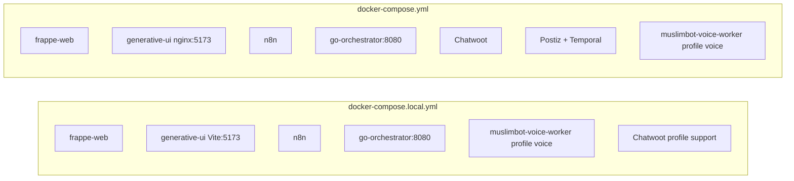

# Docker Compose — Canonical Reference

All compose files live at the **repository root**. There is no `small_erp/docker-compose.yml`.

| File | Purpose | Frappe image | small_erp source |
|------|---------|--------------|------------------|
| [`docker-compose.local.yml`](docker-compose.local.yml) | **Laptop dev** — volume-mounted app, Vite HMR | `frappe/erpnext:v15` | Hot reload via mount |
| [`docker-compose.yml`](docker-compose.yml) | **Demo VM (GCP)** — baked image + full marketing stack | `small-erp:latest` | Baked in image |
| [`docker-compose.mvp.yml`](docker-compose.mvp.yml) | **Legacy minimal MVP** — baked image, core ERP only | `small-erp:latest` | Baked in image |

**Not in tree:** `docker-compose.saas.yml`, `docker-compose.override.yml`. Multi-tenant SaaS is handled separately via [`scripts/setup.sh`](scripts/setup.sh) and [`scripts/provision-tenant.sh`](scripts/provision-tenant.sh) (expects Traefik / `MASTER_SITE` naming — restore saas compose before using in production).

---

## Quick start by mode

### Local development

```bash
cp .env.template .env
docker compose -f docker-compose.local.yml up -d
bash small_erp/scripts/install-local.sh
```

Optional Chatwoot: `docker compose -f docker-compose.local.yml --profile support up -d`  
Optional voice worker: `docker compose -f docker-compose.local.yml --profile voice up -d`

### Demo VM (GCP)

See [wayToDemo.md](wayToDemo.md) for the full VM prep guide (prerequisites, `.env`, scripts, n8n import, demo script).

```bash
cp .env.template .env
# Edit: POSTGRES_SHARED_PASSWORD, POSTIZ_JWT_SECRET, public URLs for VM IP
docker build -t small-erp:latest .
docker compose up -d
bash small_erp/scripts/install-demo.sh
docker compose --profile voice up -d   # optional Muslimbot voice worker
```

**Fresh demo VM** (no legacy per-app Postgres volumes):

```bash
docker compose down -v   # wipes volumes — only on new installs
```

**Upgrading** from old Chatwoot-only Postgres:

```bash
bash scripts/configure-postgres-multidb.sh
```

### Legacy MVP

```bash
docker build -t small-erp:latest .
docker compose -f docker-compose.mvp.yml up -d
bash small_erp/scripts/install-demo.sh
```

---

## Profiles

| Profile | Compose file | Services enabled |
|---------|--------------|------------------|
| *(default)* | local + demo | Core ERP, n8n, generative-ui; KB via **go-orchestrator** |
| `support` | **local only** | Chatwoot rails + worker |
| `voice` | local + demo | **muslimbot-voice-worker** (LiveKit agent) |

Chatwoot is **always on** in demo compose (no profile). Postiz + Temporal run in demo compose only.

---

## Ports (all modes)

| Service | Default port | URL (local) |
|---------|-------------|-------------|
| small_erp `/ops` | 8000 | http://localhost:8000/ops |
| Generative UI | 3000 / 5173 | http://localhost:3000 (demo) / :5173 (legacy Vite) |
| Go orchestrator | 8080 | http://localhost:8080/v1/sys/health |
| n8n | 5678 | http://localhost:5678 |
| LiveKit | 7880 | ws://localhost:7880 |
| Chatwoot | 3000 | http://localhost:3000 |
| Postiz | 4007 | http://localhost:4007 |
| Temporal UI | 8088 | http://localhost:8088 |

Demo VM: replace `localhost` with `<vm-ip>`.

Stop VM when not demoing (GCP): `gcloud compute instances stop liteerp-demo`  
Static IP stays attached at $0 while VM is stopped; disk billing continues (~$20/mo for 200GB).

---

## Service matrix



### Muslimbot topology

One Docker image (`Muslimbot-voice-agent/`) runs two processes:

| Service | Command | Port | Always on? |
|---------|---------|------|------------|
| `go-orchestrator` | Go `/v1/*` KB + voice session | 8080 | Via extended/platform compose |
| `muslimbot-voice-worker` | `python agent.py start` | LiveKit | `--profile voice` |

generative-ui proxies:

- `/api/*` → Frappe (`frappe-web:8000`)
- `/v1/kb/*` → Go orchestrator (ingestion, RAG, voice session)

Standalone (external network): `cd Muslimbot-voice-agent && docker compose up` (expects `liteerp_smb-net`).

---

## After code changes (local)

Python / API:

```bash
docker compose -f docker-compose.local.yml restart frappe-web frappe-scheduler frappe-worker-default frappe-worker-short frappe-worker-long frappe-socketio
```

HTMX templates / CSS / JS:

```bash
docker compose -f docker-compose.local.yml exec frappe-web bench build --app small_erp
docker compose -f docker-compose.local.yml restart frappe-web
```

generative-ui (Vite HMR picks up most changes automatically; rebuild demo image after env changes):

```bash
docker compose build generative-ui && docker compose up -d generative-ui
```

---

## Shared Postgres (demo only)

One `postgres-shared` instance (`pgvector/pg16`) hosts three databases:

- `chatwoot` — Chatwoot (with `vector` extension)
- `postiz` — Postiz
- `temporal` — Temporal workflow engine

Init on first volume boot: [`configs/postgres/init-multidb.sh`](configs/postgres/init-multidb.sh)  
Idempotent re-run: [`scripts/configure-postgres-multidb.sh`](scripts/configure-postgres-multidb.sh)

---

## Environment variable matrix

| Variable | Read by | Notes |
|----------|---------|-------|
| `FRAPPE_SITE_NAME` | Frappe, install scripts | Site hostname (e.g. `small.localhost`) |
| `FRAPPE_SITE_HOST` | generative-ui nginx | Host header for Frappe proxy (e.g. `small.localhost:8000`) |
| `FRAPPE_API_KEY` / `FRAPPE_API_SECRET` | Go orchestrator, n8n | Generate in ERPNext → Settings → API Access |
| `VITE_GEMINI_API_KEY` | generative-ui build | Browser-side Gemini NLP router |
| `GEMINI_API_KEY` / `GOOGLE_API_KEY` | Go, n8n, voice worker | Server-side Gemini (voice, RAG, KB) |
| `GO_ORCHESTRATOR_URL` | voice worker | Default `http://go-orchestrator:8080` |
| `ORCHESTRATOR_SERVICE_API_KEY` | Go, n8n | Trusted internal service auth (`X-Service-API-Key`) |
| `WORKLOAD_JWT_SECRET` | Go | Signs LiveKit worker JWTs for `/v1/agent/*` |
| `TENANT_ID` | voice worker fallback | Only used if dispatch metadata is missing |
| `LIVEKIT_INTERNAL_URL` | Go dispatch | Docker-internal LiveKit URL |
| `LIVEKIT_PUBLIC_URL` | Go → browser | Browser-resolvable `wss://…` URL |
| `LIVEKIT_URL` | voice worker | Worker WebSocket URL |
| `LIVEKIT_API_KEY` / `LIVEKIT_API_SECRET` | Go, voice worker | LiveKit credentials |
| `LIVEKIT_AGENT_NAME` | Go dispatch, voice worker | Default `muslimbot` |
| `POSTGRES_SHARED_PASSWORD` | demo only | Chatwoot + Postiz + Temporal |

**Google AI Studio:** use one key from [aistudio.google.com](https://aistudio.google.com) and set all three:

```bash
VITE_GEMINI_API_KEY=<same>
GEMINI_API_KEY=<same>
GOOGLE_API_KEY=<same>
```

Root template: [`MuslimBot/.env.template`](MuslimBot/.env.template).

KB / voice APIs (Go only):

- `POST /v1/kb/sources/*` — ingestion
- `POST /v1/kb/retrieve`, `POST /v1/kb/chat` — RAG
- `POST /v1/kb/voice/session` — browser token + named agent dispatch
- `POST /v1/agent/tool-actions` — durable confirmed ERP tools for the voice worker

---

## Memory budget (demo VM, e2-standard-8)

Approximate container limits total ~15–17 GB (Postiz + Temporal + Elasticsearch included), ~17.5 GB with Muslimbot voice worker — fits 32 GB VM with headroom for OS and spikes.
