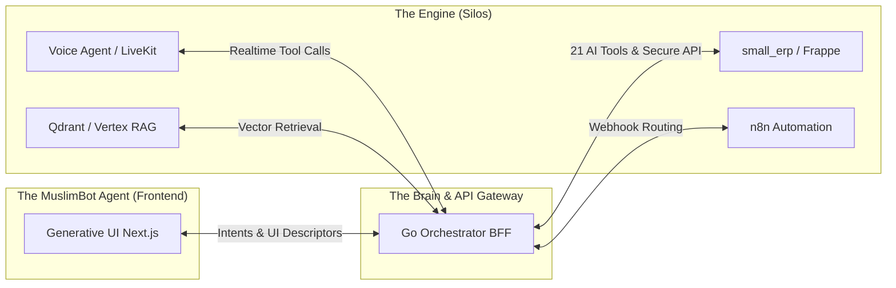

# MuslimBot System Overview (ROOT)

## 1. What is MuslimBot?
MuslimBot is an advanced, sovereign, AI-first operating system built for digital businesses and SMEs. It eliminates the friction of traditional SaaS silos by offering a **"Single Pane of Glass"** Generative UI where users control their ERP, Omnichannel Support, Marketing, and Voice Agents entirely through conversational AI and integrated portals.

## 2. Core Philosophy
* **Single UI (The MuslimBot Agent):** You don't click through 5 nested menus to approve a leave request or check sales metrics. You ask the GenUI, and it dynamically renders the appropriate confirmation card or data chart.
* **Headless ERP:** Frappe/ERPNext (`small_erp`) acts solely as the robust backend data and logic layer. It enforces permissions but serves no frontend presentation to the end-user.
* **Sovereignty & Privacy First:** All core components, including data storage, voice recordings (MinIO), vector embeddings (Qdrant), and LLM privacy layers (Presidio), are designed to be entirely self-hostable.

## 3. High-Level Architecture Diagram

## 4. Subsystem Breakdown
* **Go Orchestrator:** The API gateway, OIDC identity handler, and executor for all AI Tools. It serves as the single ingress for the GenUI and external webhooks.
* **Generative UI:** The Next.js frontend featuring `serverBrain.js` that translates natural language intents into rich React components and embeds external silos via the SecurePortal iframe.
* **Small ERP:** The heavily customized Frappe app storing standard business objects (HR, Sales, Support, Inventory).
* **Voice Agent:** A Python LiveKit + Gemini Live worker that handles incoming phone calls (SIP via Asterisk) and triggers the Go Orchestrator's tools with sub-800ms latency.
* **n8n & External Services:** Handles background tasks, cron jobs, webhook routing, marketing campaigns (Mautic), and social media publishing (Postiz).

## 5. Documentation Directory Guide
* `docs/MuslimBot_System.md`: Deep dive into business value, capabilities, and infrastructure.
* `docs/workflows/`: Practical user flows, histories, and story mapping (e.g., `context.md`, `Workflows.md`).
* `docs/MUSLIMBOT_OSS_EXPANSION_PLAN.md`: Roadmap for sovereign infrastructure features (Terraform, Asterisk, MinIO).
* `skills/`: Standardized operating procedures and tools for AI agents managing the system.
* `docs/UNIFIED_SYSTEM_PLAN.md`: Master reconciliation plan comparing the product roadmap to the current repo state.
