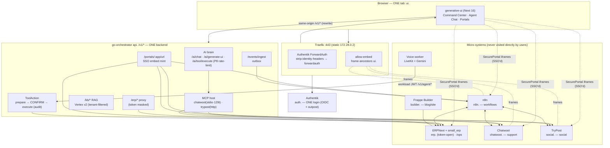
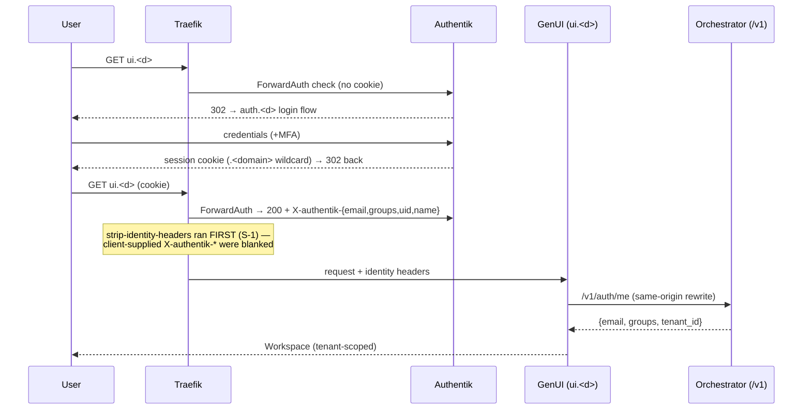
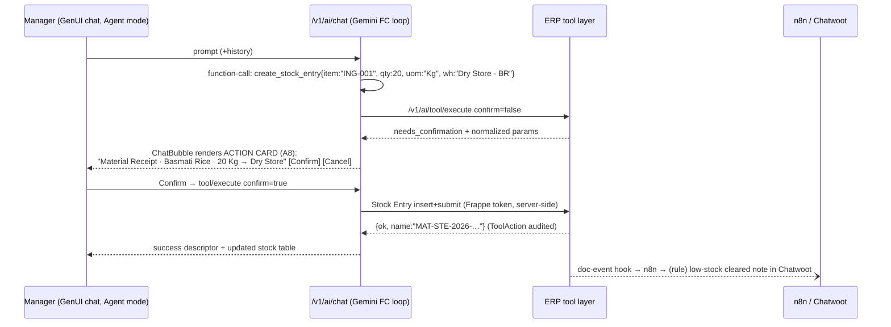

# MuslimBot Unified Platform — Micro-System Analysis, Design & Roadmap

**Status:** design, grounded in the working tree (2026-07-20) · **Owner:** platform
**Companions:** [`SYSTEM_OVERVIEW.md`](SYSTEM_OVERVIEW.md) (vision),
[`GENUI_UNIFIED_IMPLEMENTATION_PLAN.md`](GENUI_UNIFIED_IMPLEMENTATION_PLAN.md) (GenUI build),
[`../production/AGENT_DEPLOYMENT_GUIDE.md`](../production/AGENT_DEPLOYMENT_GUIDE.md) (deploy),
[`PLATFORM_ORCHESTRATOR_SPEC.md`](PLATFORM_ORCHESTRATOR_SPEC.md) (backend deep spec).

**Thesis:** every micro-system stays best-of-breed and replaceable, but the user only ever
sees **generative-ui**; the only backend the frontend knows is **go-orchestrator `/v1/*`**.
Agents (chat + voice) act across all systems through the orchestrator's MCP host, with
**confirm-first writes**. This doc: (1) current state of every micro-system, (2) target
architecture diagrams, (3) auth design incl. UI screens, (4) frontend spec, (5) backend spec,
(6) the agent "update inventory" flow, (7) the **restaurant demo seed**, (8) roadmap,
(9) a copy-paste **UI design prompt**.

---

## 1. Micro-system inventory — current state (verified in-tree)

| # | Micro-system | Role | Current state | Gaps → roadmap ref |
|---|---|---|---|---|
| 1 | **generative-ui** (root, Next 16/React 19) | THE single pane | Workspace shell + nav pill (7 silos), `SecurePortal` embeds, dashboard/agent chat modes, typed `/v1` client, same-origin `/v1/*` rewrite, standalone Docker build | Live data wiring for KPI cards; persistent-iframe shell; realtime activity feed (R2, R4) |
| 2 | **go-orchestrator** (Go/Gin :8080) | ONE backend/BFF, MCP host, AI brain | `/v1` surface live: auth/me, ERP proxy, KB (sources/RAG/voice-brief), portals, `ai/chat`+`generate-ui`+`tool/execute` (rate-limited), `mcp/*`, workflows, events outbox, tenants, `/v1/agent/*` (workload JWT) with **ToolAction prepare→confirm**. Security floor G2/G4/G5/G6/P8; `MustValidate` boot gate | G10 tenant fail-closed verify; SSE/event push to UI; CORS none (by design — same-origin) (R1, R4, R5) |
| 3 | **ERPNext + small_erp** (Frappe v15) | System of record (inventory, sales, accounting, POS) | Headless APIs (`api/*.py` per domain) + `/ops` HTMX for operators; SMB roles desk-blocked; doc-event hooks → n8n; 21-tool executor exposed via orchestrator | Restaurant vertical seed (this doc §7); purchase/supplier flows unseeded (R3) |
| 4 | **Frappe Builder** | Business blog/website | Traefik route `builder.<d>` exists; **app NOT installed** in image | Install + bake into Dockerfile; publish tenant site (R3) |
| 5 | **Chatwoot** | Omnichannel support | Deployed; portal **magic-link SSO implemented** (`portals/handler.go`); vendored `mcp-chatwoot` (129 tools, stdio via bun) | Token + inbox + webhook are install-time config; agent-assisted SOPs (R2) |
| 6 | **TryPost** | Social scheduling (12 networks) | Vendored submodule; router `social.<d>`; HTTP MCP `http://trypost/mcp/trypost`; OIDC portal | Provider OAuth apps (manual); publish confirm rule in router (R2) |
| 7 | **n8n** | Event fabric / automation | 5 workflow JSONs in-tree (ai-assistant, erp-events, chat-support-rag, chatwoot-support-vertex, nextcloud-kb-ingest); ERP hooks fire `_notify_n8n()` | Import/activate is install-time; needs orchestrator outbox consumer (R4) |
| 8 | **Authentik** | Identity (SSO, one login) | Compose + Traefik chain `strip-identity-headers → authentik-forwardauth` (S-1 applied); routers pinned; `ui.`+`api.` protected, `erp.` token-open | OIDC provider/app + outpost are web-UI config; ERPNext Social Login Key (R1) |
| 9 | **Traefik** | Edge, TLS, embed policy | Static IP 172.28.0.2 (G2 pin); `allow-embed` middleware (frame-ancestors `ui.<d>`) on chatwoot/n8n/trypost | ACME on real domain; per-app CSP audit (R1) |
| 10 | **Voice agent** (LiveKit + Gemini) | Hands-free ops | Worker joins room via Go dispatch; tools via `/v1/agent/*` with workload JWT; ToolAction confirm for writes | Realtime KB events (`kb:events:<tenant>`) mid-call (R5) |
| 11 | **KB / RAG** (Vertex) | Grounded answers | Sources CRUD, retrieve/chat, voice-brief; v2 tenancy migration + tests in-tree (ADR-0002) | v2 corpus cutover + `filtered_retrieval:true` (R5) |
| 12 | **erp-flutter** | Mobile client | Feature-complete against Frappe API | Out of unified-pane scope; later: point at `/v1` (R6) |
| 13 | Platform stores | State | MariaDB (ERP), platform-Postgres (orchestrator/Authentik), trypost-pg, shared Redis | — |

**Bottom line:** the platform is architecturally complete; remaining work is *wiring +
configuration + data*, not new systems. The silo risk is concentrated in three places:
Builder not installed, install-time tokens (Chatwoot/TryPost), and the UI still showing mock
KPIs instead of `/v1/erp` + `/v1/platform/services` data.

---

## 2. Target architecture

### 2.1 System diagram



### 2.2 The three auth planes (backend truth)

| Plane | Who | Mechanism | Enforced by |
|---|---|---|---|
| Human | browser → `ui.`/`api.` | Authentik ForwardAuth cookie → `X-authentik-*` headers | Traefik chain (S-1) + `AuthentikMiddleware` + G2 proxy-CIDR pin |
| Workload | voice workers → `/v1/agent/*` | short-lived **workload JWT** (`WORKLOAD_JWT_SECRET`) | `WorkloadMiddleware` |
| Service | n8n / machines → ERP + webhooks | `Authorization: token k:s` (Frappe) · `X-Service-API-Key` (Go) · HMAC `WEBHOOK_SECRET` | Frappe / Go handlers |

---

## 3. Auth & SSO design — with UI screens

### 3.1 Login flow (sequence)



Embedded portals reuse the same session: `SecurePortal` asks `/v1/portals/:app/url`, the
orchestrator mints the per-app hop (Chatwoot **magic-link**, n8n **forward_auth**, TryPost
**oidc**, ERP **proxy**) — the user never sees a second login.

### 3.2 Screen inventory (auth surface)

| # | Screen | Owner | Content & behaviour |
|---|---|---|---|
| A1 | **Splash / gate** | GenUI | Brand mark + "Continue to your business" button → Authentik redirect. Shown only when `/v1/auth/me` 401s. No local password field — ever. |
| A2 | **Sign-in** | Authentik (themed) | Email+password, MFA, "forgot password" enrollment flows. Brand the Authentik flow (logo, emerald accent, dark) so it feels native. |
| A3 | **First-run enrollment** | Authentik | Invited business user sets password + MFA; group membership = tenant. |
| A4 | **Workspace loading** | GenUI | Skeleton shell while `/v1/auth/me` + `/v1/platform/services` resolve. |
| A5 | **Profile / session menu** | GenUI (avatar in nav pill) | name/email/tenant from `auth/me`; "Manage account" → `auth.<d>/if/user/`; **Sign out** → Authentik logout endpoint (kills the wildcard cookie). |
| A6 | **Tenant switcher** | GenUI (multi-tenant users) | Lists tenants from groups; switching re-scopes every query (orchestrator resolves tenant server-side — UI never sends tenant ids on writes). |
| A7 | **403 / no-tenant** | GenUI | "Your account isn't linked to a business yet" + contact CTA. Fail-closed (G10): unknown tenant ⇒ this screen, not default data. |
| A8 | **Action confirmation** | GenUI (modal/card in chat) | THE trust screen — see §6. Renders ToolAction: tool, human summary, parameter table, Confirm/Cancel. Writes NEVER execute without it. |

---

## 4. Frontend specification — generative-ui

**Stack (locked):** Next.js 16 App Router · React 19 · Tailwind v4 (semantic tokens in
`globals.css` — `bg-surface`, `text-primary`, `text-accent`…) · lucide-react only ·
TypeScript strict. API access **exclusively** via [`src/lib/api.ts`](../../../generative-ui/src/lib/api.ts)
→ same-origin `/v1/*` (Next rewrite → orchestrator). **No secrets, no direct system URLs, no
second backend — the frontend knows only `/v1`.**

### 4.1 Route map

> ⚠ **Stale as of 2026-07-20:** the app was restructured — routes flattened to `/`, `/erp`,
> `/kb`, `/support`, `/marketing`, `/workflows`, `/agent`, `/system` (no `/workspace` prefix);
> `SecurePortal` → `IframeWrapper`; shell = `Sidebar` + root layout (chat + voice overlay
> global). Current truth + gap register:
> [`UNIFICATION_GAP_ANALYSIS_AND_IMPLEMENTATION.md`](UNIFICATION_GAP_ANALYSIS_AND_IMPLEMENTATION.md).

| Route | Surface | Data |
|---|---|---|
| `/workspace` | Command Center: KPI row, revenue chart, activity feed, system health | `erpCall('api.dashboard.*')`, `platformServices()`, `mcpServers()` |
| `/workspace/erp` | Native ERP surface (tables/forms via descriptors) | `/v1/erp/*` proxy |
| `/workspace/support` | `SecurePortal targetApp="chatwoot"` | `/v1/portals/chatwoot/url` |
| `/workspace/social` | `SecurePortal targetApp="trypost"` | `/v1/portals/trypost/url` |
| `/workspace/workflows` | `SecurePortal targetApp="n8n"` | `/v1/portals/n8n/url` |
| `/workspace/site` *(new, R3)* | `SecurePortal targetApp="erp-ops"` variant for Builder (`builder.<d>/builder`) | portal endpoint gains `builder` case |
| `/workspace/knowledge` | KB browser: sources, upload, RAG test chat | `/v1/kb/*` |
| `/workspace/ai` | Agent explainer + full-screen chat | — |
| `/workspace/settings` | Profile, tenant, connected systems status | `authMe()`, `platformServices()` |

### 4.2 Component contracts

- **`AiChatPanel`** (persistent, in layout, z-50 above iframes): two modes —
  **Agent** → `POST /v1/ai/chat` (MCP function-calling), **Dashboard** → `POST /v1/ai/generate-ui`
  (UiDescriptor → `GenerativeRenderer`). Must render **`action` descriptors as confirm cards**
  (A8): Confirm ⇒ `executeTool(tool, params, confirm=true)`; Cancel ⇒ chat note. Persona quick
  actions per vertical (restaurant: "86 an item", "today's covers", "low kitchen stock").
- **`SecurePortal`**: two-phase load, 12s timeout, retry re-mints URL, cross-origin-only
  sandbox invariant (S-2), error card. Upgrade path: persistent-iframe shell (mount once,
  `hidden` toggle) so portal sessions survive tab switches.
- **`GenerativeRenderer`**: maps `UiDescriptor.component` → metrics/chart/table/card/action/
  rag/text. Every AI answer that contains data must arrive as a descriptor, not prose.
- **Realtime (R4):** poll `/v1/platform/services` 30s; activity feed upgrades to SSE when the
  orchestrator exposes `/v1/events/stream`.

### 4.3 Non-functional

Same-origin only (rewrite handles CORS-free calls) · every fetch `credentials:'include'` ·
skeletons for all loading states, never blank iframes · dark default + `.light` theme ·
keyboardable chat + focus rings (`focus:ring-accent`) · LCP < 2.5s on the Command Center with
KPIs cached per session.

---

## 5. Backend specification — go-orchestrator

**Locked surface** (from `cmd/server/main.go`; extend, don't fork):

| Group | Endpoints | Notes |
|---|---|---|
| Public | `GET /v1/sys/health` · `POST /v1/webhooks/:source` | HMAC-verified webhooks |
| Human (`AuthentikMiddleware`) | `auth/me` · `erp/*path` proxy · `kb/*` (sources, upload, url, retrieve, chat, voice-session, voice-brief, org) · `portals/:app/url` · `ai/chat` · `ai/generate-ui` · `ai/tool/execute` (all `ai/*` behind P8 limiter) · `mcp/servers|tools|call` · `workflows/trigger` · `events/ingest` · `tenants*` · `platform/services` | identity from headers only after Traefik chain; G2 CIDR pin |
| Workload (`WorkloadMiddleware`) | `agent/tools` · `agent/kb/*` · `agent/sessions/*` · `agent/tool-actions` (prepare) · `agent/tool-actions/:id/confirm` · `agent/tool-actions/:id` | voice workers |

**Invariants (the platform contract):**
1. **Confirm-first writes.** Any state-changing tool (`ai/tool/execute` without `confirm=true`,
   or a ToolAction in `prepared`) returns a confirmation payload; execution requires the
   explicit second call. Applies equally to chat, voice, and MCP-initiated writes
   (high-stakes MCP tools — e.g. TryPost publish — routed through the same gate).
2. **Tenant fail-closed (G10).** Unresolvable tenant ⇒ 403, never default scope. Every MCP
   call carries the caller's tenant context; server-side account/workspace scoping.
3. **Secrets stay server-side.** Frappe tokens, Chatwoot/TryPost keys, Gemini key are injected
   by the orchestrator; the browser only ever holds the Authentik cookie.
4. **One rate-limit choke** for AI spend (P8: 30/min, burst 10, per identity).
5. **Events are outbox-durable**: doc events → `/v1/events/ingest` → outbox table → n8n
   delivery with retry; consumers must be idempotent.

**Additions needed (R-refs):** `builder` case in `portals/handler.go` (R3) ·
`GET /v1/events/stream` SSE for the activity feed (R4) · G10 verification tests (R5).

---

## 6. The headline flow — "update inventory" by asking the agent

> Restaurant manager types: **"We received 20 kg basmati rice — add it to Dry Store."**



Same skeleton serves every cross-system ask — "86 the beef kacchi" (Item disable), "schedule
Friday's special on our socials" (TryPost MCP, publish confirm-gated), "summarize open
complaints" (Chatwoot MCP read, no confirm needed). Voice follows the identical path through
`/v1/agent/tool-actions` with spoken confirmation.

---

## 7. Restaurant demo seed — "Baraka Restaurant"

Implemented: [`small_erp/seed_restaurant.py`](../../small_erp/small_erp_app/small_erp/seed_restaurant.py)
(idempotent, mirrors `seed_demo.py`). Run on the VM:

```bash
bench --site "$SITE" execute small_erp.seed_restaurant.create_restaurant_demo
# via compose: dc exec -T frappe-web bench --site "$SITE" execute small_erp.seed_restaurant.create_restaurant_demo
```

| Layer | Seeded state |
|---|---|
| Company | **Baraka Restaurant** (reuses existing company if one exists — no forked books) |
| Warehouses | Kitchen Store · Cold Storage · Dry Store · Front Counter |
| Menu (sales items) | 8 dishes/drinks (`MENU-*`): biryani, kacchi, grilled chicken, naan, lassi… priced in Standard Selling |
| Kitchen stock | 6 ingredients (`ING-*`: basmati rice, halal chicken/beef, oil…) + 2 packaging (`PKG-*`), opening qty per station |
| Customers | Walk-in Guest (Dine-In) · FoodPanda/UberEats (Delivery Platform, on credit) · Al-Noor Center + TechPark (Catering) |
| Sales history | 10 invoices across 7 days — small paid dine-in tickets, large platform receivables, catering orders → real KPI/receivables shape |

**Beyond ERP, complete the restaurant state** (agent-driven or manual, per
[`AGENT_DEPLOYMENT_GUIDE.md`](../production/AGENT_DEPLOYMENT_GUIDE.md) phases 9–14):
Chatwoot inbox "Reservations & Orders" + demo conversation ("do you cater for 60 people
Friday?") · TryPost drafts ("Friday Kacchi Special") · Builder site: menu page + 2 blog posts ·
KB uploads: menu PDF, halal certification, delivery-zone policy → the agent answers "is your
beef halal-certified?" grounded · n8n rule: `Bin.actual_qty < 10` on any `ING-*` → Chatwoot
private note to the manager.

**Demo script (5 min):** login once → dashboard shows last week's covers/revenue → ask agent
"what's low in the kitchen?" (table) → "add 20 kg basmati rice to Dry Store" (confirm card →
stock updated) → Support tab: reply to the catering inquiry with agent-drafted KB-grounded
answer → "schedule the Friday special post" (TryPost draft, publish gated) → blog on
`builder.<d>` shows the menu.

---

## 8. High-level implementation roadmap

| Phase | Scope | Exit criterion |
|---|---|---|
| **R0 — Deploy floor** *(done in-tree)* | Edge fixes, S-1 chain, allow-embed, GenUI shell + SecurePortal + agent mode, same-origin `/v1` | stack boots; `verify` green locally |
| **R1 — One login** | Authentik OIDC app + outpost; ERPNext Social Login; themed A1–A5 screens; real domain + ACME (`SameSite=None` for iframes) | one login spans all 6 systems; forged header ⇒ 401 |
| **R2 — Agent everywhere** | `GEMINI_API_KEY`; Chatwoot+TryPost tokens; `/v1/mcp/servers` both connected; confirm cards (A8) wired to `tool/execute`; persona quick-actions | §6 flow passes end-to-end in UI **and** voice |
| **R3 — Business surfaces** | Builder installed + baked into image + portal case + `/workspace/site`; restaurant seed (§7) + Chatwoot/TryPost/KB/Builder demo state | 5-min demo script runs clean |
| **R4 — Live pane** | KPI cards on `/v1/erp` real data; events outbox → n8n consumers; `/v1/events/stream` SSE feed; persistent-iframe shell | invoice in ERP appears in feed < 5s |
| **R5 — Multi-tenant hardening** | G10 fail-closed verified + isolation tests; KB v2 corpus cutover (ADR-0002); `./setup.sh tenant` E2E (Authentik group + Chatwoot account + TryPost workspace + site) | tenant A cannot touch tenant B via ANY path incl. `mcp/call`; restore drill done |
| **R6 — Scale-out** | erp-flutter onto `/v1`; template gallery of verticals (restaurant/pharma/retail seeds); billing hooks | second vertical onboards in < 1 day |

Sequence rationale: R1 unblocks everything user-facing; R2 is the product's headline; R3 makes
it demoable to a real business; R4 makes it feel alive; R5 makes it sellable.

---

## 9. UI design prompt (copy-paste to a designer or design-capable AI)

```text
Design the complete UI for **MuslimBot** — an AI-first business operating system where one
web app controls ERP, customer support, social media, workflows, a website builder, and a
knowledge base. The user is a small-business owner (persona: halal restaurant manager,
non-technical, mobile-tolerant but desktop-first).

NON-NEGOTIABLE SYSTEM RULES
- One backend: every piece of data on screen comes from `/v1/*`. No screen may reference a
  sub-system's own URL or login.
- Sub-systems (Chatwoot support, TryPost social, n8n workflows, ERP ops, site Builder) appear
  ONLY as full-bleed embedded panels inside the workspace, reached from the global nav.
- The AI agent is omnipresent: a floating chat that persists across every route, expandable
  to full screen, with two modes — Agent (acts via tools) and Dashboard (renders data).
- WRITES ARE SACRED: any action that changes business state must render a Confirmation Card
  (tool name in plain language, human summary sentence, parameter table, Confirm/Cancel).
  Design this card as the most trustworthy element in the system.

DESIGN LANGUAGE (existing tokens — keep)
- Dark-first glassmorphism: bg #020617 (deep navy), surfaces #0f172a, hover #1e293b,
  text #f1f5f9 / #94a3b8, accent emerald #10b981, status green/amber/red/blue. Light theme
  via the same semantic tokens. Rounded-full pill nav, backdrop-blur, soft 30px shadows.
  Icons: lucide only. Typography: Geist Sans / Geist Mono.

SCREENS TO DELIVER (desktop 1440 + mobile 390 for starred)
1* Splash/auth gate: brand + "Continue to your business" (SSO redirect — no password field).
2  Authentik-themed sign-in + MFA + enrollment (make hosted auth feel native).
3* Command Center: KPI row (revenue, orders, low-stock, open tickets), revenue chart,
   live activity feed (cross-system events), system-health strip, persona quick actions
   ("86 an item", "today's covers", "low kitchen stock").
4* Agent chat: bubbles, generative blocks (metric grid, chart, data table, RAG citation),
   the Confirmation Card, tool-call progress state ("calling TryPost…"), error state.
5  Embedded portal frame: loading ("Authenticating with Support…"), ready, unavailable+Retry.
6  Inventory surface: stock by station (Kitchen/Cold/Dry/Counter), low-stock badges, item
   drawer, "adjust stock" flow that ends in the same Confirmation Card.
7  Knowledge Base: source list w/ sync status, upload/URL panels, RAG test chat with cited
   chunks.
8  Voice call overlay: live transcript, tool-action spoken-confirm state, mute/end.
9  Settings: profile/tenant, connected-systems health, sign-out.
10 403/no-tenant and offline/degraded states.

DELIVERABLES: component library (nav pill, KPI card, chart frame, table, chat bubbles,
confirmation card, portal frame, toasts), the 10 screens, both themes, and interaction notes
for confirm-first flows. Optimize for calm confidence: the owner should feel the whole
business is one quiet, controllable surface.
```

---

## Appendix — verification hooks

- Unified smoke: [`../testing/TEST_PLAN_GENUI_ORCHESTRATOR.md`](../testing/TEST_PLAN_GENUI_ORCHESTRATOR.md) §A–G.
- Tenant isolation: [`../testing/TEST_PLAN_REALTIME_KB_TENANT_ISOLATION.md`](../testing/TEST_PLAN_REALTIME_KB_TENANT_ISOLATION.md).
- Deploy: [`../production/AGENT_DEPLOYMENT_GUIDE.md`](../production/AGENT_DEPLOYMENT_GUIDE.md) (phases 13–15 exercise §6 of this doc).
