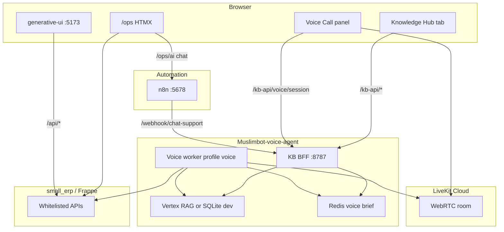

# Way to Demo — Full Stack VM Prep & Demo Script

Single guide to prepare a **demo VM** (or local laptop) for Small ERP: HTMX `/ops`, generative-ui, Knowledge Hub, Muslimbot voice, n8n, Chatwoot, and Postiz.

**Canonical compose reference:** [COMPOSE.md](COMPOSE.md)

---

## Architecture (current)



| Concern | Source of truth | UI |
|---------|-----------------|-----|
| **Live ERP data** | Frappe (`small_erp.api.*`) | `/ops`, generative-ui Command Center |
| **Knowledge base (RAG)** | Muslimbot KB BFF (`/kb-api`) | generative-ui **Knowledge Hub** |
| **Voice agent** | LiveKit worker + Redis voice brief | Knowledge Hub **Call Muslimbot** |
| **Text support RAG** | n8n → KB BFF `/chat` | `/ops/ai` quick chat |

> **Removed:** Frappe `/ops/knowledge`, `small_erp.api.knowledge.*`, and n8n `workflow-kb-scrape` / `workflow-kb-voice-sync`. Do not reintroduce dual KB sources.

---

## Part 1 — Prerequisites (before touching the VM)

### VM / host

| Item | Demo VM (GCP) | Local laptop |
|------|---------------|--------------|
| **RAM** | 32 GB recommended (`e2-standard-8`) | 16 GB minimum |
| **Disk** | 200 GB SSD | 50 GB free |
| **OS** | Ubuntu 22.04+ | macOS / Linux |
| **Software** | Docker 24+, Docker Compose v2, `git` | Same |
| **Ports open** | 8000, 5173, 5678, 8787, 3000, 4007, 8088 (firewall) | localhost only |

### Accounts & keys (create before deploy)

| Service | What you need | Used by |
|---------|---------------|---------|
| **Google AI Studio** | One API key | `VITE_GEMINI_API_KEY`, `GEMINI_API_KEY`, `GOOGLE_API_KEY` |
| **LiveKit Cloud** | Project URL + API key + secret | Voice worker + in-browser calls |
| **(Optional) GCP** | Project + service account JSON | Vertex AI RAG in production |

Get keys:

1. **Gemini:** [Google AI Studio](https://aistudio.google.com) → Create API key
2. **LiveKit:** [livekit.io](https://livekit.io) → Project → Settings → API keys

### Secrets to generate locally

```bash
# n8n encryption key (32+ chars)
openssl rand -hex 16

# Chatwoot secret (64 hex chars)
openssl rand -hex 64

# Postiz JWT
openssl rand -hex 32

# KB BFF shared secret (use same value everywhere)
openssl rand -hex 24
```

---

## Part 2 — Configure `.env` (repository root)

```bash
cd liteERP
cp .env.template .env
```

### Required for any demo

| Variable | Example / notes |
|----------|-----------------|
| `DB_ROOT_PASSWORD` | Strong MariaDB root password |
| `ADMIN_PASSWORD` | ERPNext `Administrator` login |
| `N8N_PASSWORD` | n8n UI login |
| `N8N_ENCRYPTION_KEY` | From `openssl rand -hex 16` |
| `KB_BFF_API_KEY` | Shared secret — **must match** in BFF + generative-ui proxy |
| `VITE_GEMINI_API_KEY` | Google AI Studio key |
| `GEMINI_API_KEY` | Same key (Frappe `/ops/ai`) |
| `GOOGLE_API_KEY` | Same key (Muslimbot voice + KB chat) |
| `FRAPPE_API_KEY` / `FRAPPE_API_SECRET` | Generate **after** Frappe install (see Part 4) |

### Demo VM public URLs

Set to your VM IP or domain (not `localhost`):

```bash
DEMO_PUBLIC_URL=http://34.x.x.x
N8N_HOST=34.x.x.x
N8N_WEBHOOK_URL=http://34.x.x.x:5678
CHATWOOT_FRONTEND_URL=http://34.x.x.x:3000
POSTIZ_PUBLIC_URL=http://34.x.x.x:4007
FRAPPE_SITE_HOST=small.localhost:8000   # internal Host header — keep as-is
```

### Demo VM — shared Postgres

```bash
POSTGRES_SHARED_PASSWORD=<strong password>
CHATWOOT_DB_PASSWORD=<can match or differ>
POSTIZ_DB_PASSWORD=<can match or differ>
CHATWOOT_SECRET_KEY=<openssl rand -hex 64>
POSTIZ_JWT_SECRET=<openssl rand -hex 32>
```

### Voice + Knowledge Hub (recommended for full demo)

```bash
LIVEKIT_URL=wss://your-project.livekit.cloud
LIVEKIT_API_KEY=...
LIVEKIT_API_SECRET=...
LIVEKIT_AGENT_NAME=muslimbot
```

For **demo nginx build**, `VITE_LIVEKIT_URL` is baked from `LIVEKIT_URL` at image build time (see Part 3).

### Production KB (optional — skip for dev demo)

Leave empty to use SQLite keyword RAG on the BFF:

```bash
GOOGLE_CLOUD_PROJECT=
GCS_KB_BUCKET=
VERTEX_LOCATION=asia-southeast1
```

### Deprecated — do not set

These belonged to the removed Frappe KB and are ignored:

- `GEMINI_CORPUS_PREFIX`
- `KB_VOICE_CONTEXT_MAX_CHARS`

---

## Part 3 — Deploy full stack on demo VM

Run from **repository root** on the VM.

### Step 1 — Clone and configure

```bash
git clone <repo-url> liteERP && cd liteERP
cp .env.template .env
# Edit .env — complete Part 2 checklist
```

### Step 2 — Build production image

Bakes `small_erp` into ERPNext v15:

```bash
docker build -t small-erp:latest .
```

### Step 3 — First-time volumes only

**New VM only** (destroys all data):

```bash
docker compose down -v
```

**Upgrading** an existing VM with old Postgres layout:

```bash
bash scripts/configure-postgres-multidb.sh
```

### Step 4 — Start core stack

```bash
docker compose up -d
```

This starts: MariaDB, Redis, Frappe workers, n8n, generative-ui (nginx), **muslimbot-kb-bff**, Chatwoot, Postiz, Temporal.

### Step 5 — Run install script

```bash
bash small_erp/scripts/install-demo.sh
```

The script:

1. Waits for MariaDB + Postgres
2. Ensures shared Postgres databases (`chatwoot`, `postiz`, `temporal`)
3. Creates Frappe site `small.localhost` (or migrates if exists)
4. Installs `erpnext` + `small_erp`, runs **migrate** (drops legacy KB tables if present)
5. Builds HTMX assets, seeds SMB permissions
6. Sets `n8n_url` + `google_api_key` on site (for `/ops/ai`)
7. Prepares Chatwoot DB
8. Restarts Frappe + Chatwoot

### Step 6 — Generate Frappe API keys

```bash
docker compose exec frappe-web bench --site small.localhost \
  execute frappe.client.generate_keys --args '["Administrator"]'
```

Copy `api_key` and `api_secret` into root `.env`:

```bash
FRAPPE_API_KEY=...
FRAPPE_API_SECRET=...
```

Restart services that use the token:

```bash
docker compose restart generative-ui n8n muslimbot-kb-bff
docker compose --profile voice up -d   # if voice already enabled
```

### Step 7 — Import n8n workflows

Open **http://\<vm-ip\>:5678** → Workflows → Import from file:

| File | Webhook path | Purpose |
|------|--------------|---------|
| `small_erp/configs/n8n/workflow-erp-events.json` | `/webhook/erp-event` | ERP doc events |
| `small_erp/configs/n8n/workflow-ai-assistant.json` | `/webhook/ai-assistant` | `/ops/ai` fallback |
| `small_erp/configs/n8n/workflow-chat-support-rag.json` | `/webhook/chat-support` | Text RAG via **KB BFF `/chat`** |

**Activate** each workflow. In n8n **Settings → Variables** (or container env), ensure:

- `KB_BFF_URL=http://muslimbot-kb-bff:8787`
- `KB_BFF_API_KEY` matches root `.env`

### Step 8 — Seed demo ERP data (optional but recommended)

```bash
docker compose exec frappe-web bench --site small.localhost execute small_erp.finish_setup.finish
docker compose exec frappe-web bench --site small.localhost execute small_erp.seed_demo.create_demo_data
```

### Step 9 — Rebuild generative-ui (if LiveKit URL changed)

`VITE_LIVEKIT_URL` and `VITE_GEMINI_API_KEY` are embedded at build time:

```bash
docker compose build generative-ui
docker compose up -d generative-ui
```

### Step 10 — Start voice worker (optional profile)

```bash
docker compose --profile voice up -d
```

Requires `LIVEKIT_*`, `GOOGLE_API_KEY`, and `FRAPPE_API_KEY/SECRET` in `.env`.

---

## Part 4 — Health checks (run before the demo)

```bash
# Frappe /ops
curl -s -o /dev/null -w "%{http_code}" http://localhost:8000/ops

# KB BFF
curl -s http://localhost:8787/health | jq .

# ERP connectivity from BFF
curl -s http://localhost:8787/health/erp | jq .

# generative-ui KB proxy (via nginx)
curl -s http://localhost:5173/kb-api/health | jq .

# n8n
curl -s -o /dev/null -w "%{http_code}" http://localhost:5678/healthz
```

Expected KB BFF health:

```json
{
  "status": "ok",
  "tenant_id": "default",
  "vertex_configured": false,
  "indexed_sources": 0
}
```

---

## Part 5 — Demo script (presenter walkthrough)

### URLs

| Surface | URL |
|---------|-----|
| HTMX ERP | `http://<host>:8000/ops` |
| Generative UI | `http://<host>:5173` |
| Knowledge Hub | generative-ui → **Knowledge** toggle (top nav) |
| n8n | `http://<host>:5678` |
| Chatwoot | `http://<host>:3000` |

Login: `Administrator` / `ADMIN_PASSWORD` (or SMB Manager after seeding).

### A — ERP Command Center (generative-ui)

1. Open generative-ui → default **Command Center** view
2. Ask: *"Show me today's sales"* or *"What items are low on stock?"*
3. Confirms live ERP data via Frappe APIs

### B — Knowledge Hub (index content)

1. Switch to **Knowledge Hub** in generative-ui
2. **Upload** tab: PDF or `.md` (e.g. Returns Policy)
3. **Add URL** tab: paste website, YouTube, or social link — type badge shows auto-detection
4. Wait for source status → **indexed** in source list
5. **Test Knowledge Chat**: *"What is your return policy?"*

### C — Voice agent (in-browser)

1. In Knowledge Hub, click **Call Muslimbot** (beside test chat)
2. Allow microphone
3. Try:
   - *"What is your return policy?"* → voice brief + RAG (no ERP tool)
   - *"Search for paracetamol"* → ERP `search_items`
   - *"Create an order for Demo Client…"* → ERP write with confirmation

Alternative: LiveKit Agents Playground connected to the same project.

### D — HTMX `/ops/ai` text chat

1. Open `/ops/ai`
2. Ask a policy question → n8n `chat-support` → KB BFF `/chat`
3. Ask an ERP question → Gemini with live ERP context

### E — Optional marketing stack

- **Chatwoot** — omnichannel inbox
- **Postiz** — social scheduling (`:4007`)
- **Temporal UI** — workflow monitor (`:8088`)

---

## Part 6 — Local development (laptop)

Same architecture; volume-mounted app + Vite HMR:

```bash
cp .env.template .env
docker compose -f docker-compose.local.yml up -d
bash small_erp/scripts/install-local.sh
```

Optional profiles:

```bash
docker compose -f docker-compose.local.yml --profile support up -d   # Chatwoot
docker compose -f docker-compose.local.yml --profile voice up -d     # Voice worker
```

Local URLs match demo but use `localhost`. Set `VITE_LIVEKIT_URL` in `generative-ui/.env` for host-side Vite.

---

## Part 7 — Scripts reference

| Script | When to run |
|--------|-------------|
| [`small_erp/scripts/install-demo.sh`](small_erp/scripts/install-demo.sh) | After `docker compose up -d` on demo VM |
| [`small_erp/scripts/install-local.sh`](small_erp/scripts/install-local.sh) | After `docker compose -f docker-compose.local.yml up -d` |
| [`scripts/configure-postgres-multidb.sh`](scripts/configure-postgres-multidb.sh) | Upgrade path for shared Postgres |
| `docker build -t small-erp:latest .` | Before demo/MVP deploy or after backend changes |
| `bench migrate` | Pulled code with Frappe patches (included in install scripts) |

### After pulling KB-cleanup branch

```bash
# Demo VM
docker build -t small-erp:latest .
docker compose up -d
docker compose exec frappe-web bench --site small.localhost migrate
bash small_erp/scripts/install-demo.sh

# Re-import workflow-chat-support-rag.json in n8n (now calls KB BFF)
docker compose build generative-ui && docker compose up -d generative-ui
docker compose --profile voice up -d
```

---

## Part 8 — Troubleshooting

| Issue | Fix |
|-------|-----|
| `/ops` 502 or blank | `docker compose logs frappe-web`; re-run `install-demo.sh` |
| KB BFF down | `docker compose ps muslimbot-kb-bff`; `curl :8787/health` |
| generative-ui `/kb-api` 401 | Match `KB_BFF_API_KEY` in `.env` and nginx env |
| generative-ui `/kb-api` 502 | BFF not on network; `depends_on muslimbot-kb-bff` |
| Voice call fails immediately | Set `LIVEKIT_*`; rebuild generative-ui with `LIVEKIT_URL`; start `--profile voice` |
| Agent does not join room | Worker running? `agent_name=muslimbot` on worker; check BFF dispatch logs |
| `/ops/ai` generic answers | Import + activate `workflow-chat-support-rag.json`; set `GOOGLE_API_KEY` |
| n8n chat-support errors | Set `KB_BFF_URL` + `KB_BFF_API_KEY` in n8n env |
| ERP tools fail in voice | Set `FRAPPE_API_KEY/SECRET`; restart voice worker |
| `health/erp` fails | API keys missing or wrong; check `small_erp.api.dashboard.get_dashboard_kpis` |
| Migrate error on KB tables | Expected once — patch drops `AI Knowledge Source` DocTypes |
| Out of memory on VM | Stop Postiz/Temporal when not needed; see [COMPOSE.md](COMPOSE.md) memory budget |

### Useful logs

```bash
docker compose logs -f muslimbot-kb-bff
docker compose logs -f muslimbot-voice-worker
docker compose logs -f generative-ui
docker compose logs -f frappe-web
```

### Rebuild voice brief manually

```bash
curl -X POST http://localhost:8787/voice-brief/rebuild \
  -H "X-KB-API-Key: $KB_BFF_API_KEY"
```

---

## Part 9 — API quick reference

### Knowledge Hub (Muslimbot BFF — via `/kb-api` proxy)

| Method | Path | Purpose |
|--------|------|---------|
| GET | `/health` | BFF status |
| GET | `/health/erp` | Frappe connectivity |
| GET | `/sources` | List KB sources |
| POST | `/sources/upload` | Upload document |
| POST | `/sources/url` | Smart URL ingest |
| POST | `/sources/url/classify` | Preview URL type |
| POST | `/chat` | RAG test chat |
| POST | `/voice/session` | LiveKit token + agent dispatch |
| GET | `/voice-brief` | Cached voice context preview |
| POST | `/voice-brief/rebuild` | Refresh Redis voice brief |

### Frappe (ERP)

| Method | Endpoint |
|--------|----------|
| Chat (text) | `small_erp.api.ai_agent.chat_message` |
| AI status | `small_erp.api.ai_agent.get_ai_status` |
| ERP tools (n8n) | `small_erp.services.erp_agent_tools.execute_erp_tool` |

---

## Part 10 — Stopping the demo VM (GCP)

```bash
# Stop compute (keeps disk + static IP)
gcloud compute instances stop liteerp-demo --zone=<zone>

# Start again before demo
gcloud compute instances start liteerp-demo --zone=<zone>
docker compose up -d
```

---

## Related docs

- [COMPOSE.md](COMPOSE.md) — compose files, ports, profiles, env matrix
- [README.md](README.md) — project overview
- [Muslimbot-voice-agent/README.md](Muslimbot-voice-agent/README.md) — voice tools + BFF detail
- [generative-ui/README.md](generative-ui/README.md) — proxy + Knowledge Hub UI
