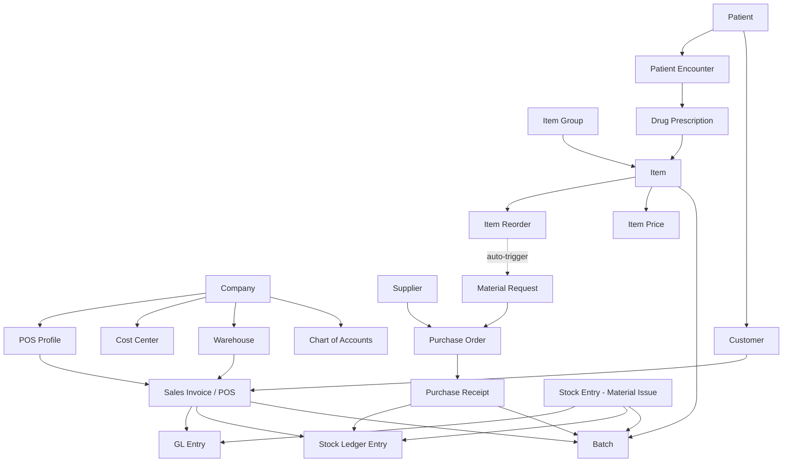

# Antigravity Pharmacy — ERPNext Full-Stack Setup & 24-Month Seed Data

> **Business**: Antigravity Pharmacy
> **Location**: Bazar Road, Narayanganj Sadar, Narayanganj 1400, Dhaka Division, Bangladesh
> **Currency**: BDT (৳)  |  **Timezone**: Asia/Dhaka
> **Live Since**: July 2024  |  **Current Date**: July 12, 2026
> **Domains Enabled**: Healthcare, Accounts, Stock, POS

---

## Phase 1: Environment Setup from an Empty Directory

### 1.1 — Clone & Configure Frappe Docker

```bash
# Start from an empty project directory
mkdir antigravity-pharmacy && cd antigravity-pharmacy

# Clone the official Frappe Docker repository
git clone https://github.com/frappe/frappe_docker.git
cd frappe_docker

# Copy the example environment file
cp example.env .env
```

Edit `.env` with the following values:

```dotenv
# .env — Antigravity Pharmacy
FRAPPE_VERSION=v15
ERPNEXT_VERSION=v15
LETSENCRYPT_EMAIL=admin@antigravitypharmacy.com
FRAPPE_SITE_NAME_HEADER=antigravity.localhost
DB_ROOT_PASSWORD=AntiGrav!DB2024
MYSQL_ROOT_PASSWORD=AntiGrav!DB2024
SITE_ADMIN_PASSWORD=admin
```

### 1.2 — Start the Docker Stack

```bash
# Bring up all services in detached mode using the development overrides
docker compose -f compose.yaml \
  -f overrides/compose.erpnext.yaml \
  -f overrides/compose.mariadb.yaml \
  -f overrides/compose.redis.yaml \
  up -d

# Verify all containers are healthy
docker compose ps
```

> [!NOTE]
> Wait 60–90 seconds for MariaDB to fully initialize before proceeding.

### 1.3 — Create the Site & Install ERPNext

```bash
# Enter the backend container
docker compose exec backend bash

# Create a new site
bench new-site antigravity.localhost \
  --mariadb-root-password AntiGrav!DB2024 \
  --admin-password admin \
  --no-mariadb-socket

# Install ERPNext
bench --site antigravity.localhost install-app erpnext

# Install the Healthcare module (ships as a separate app in v15)
bench get-app healthcare
bench --site antigravity.localhost install-app healthcare

# Enable developer mode (optional, useful for seed scripting)
bench --site antigravity.localhost set-config developer_mode 1

# Set this as the default site
bench use antigravity.localhost
```

### 1.4 — Localize the Site

```bash
# Inside the backend container (bench console)
bench --site antigravity.localhost console
```

```python
import frappe

# Set System Settings
sys_settings = frappe.get_doc("System Settings")
sys_settings.country = "Bangladesh"
sys_settings.time_zone = "Asia/Dhaka"
sys_settings.language = "en"
sys_settings.date_format = "dd-mm-yyyy"
sys_settings.time_format = "HH:mm:ss"
sys_settings.number_format = "#,###.##"
sys_settings.currency = "BDT"
sys_settings.first_day_of_the_week = "Saturday"
sys_settings.save(ignore_permissions=True)

# Set Global Defaults
global_defaults = frappe.get_doc("Global Defaults")
global_defaults.default_currency = "BDT"
global_defaults.default_company = "Antigravity Pharmacy"
global_defaults.country = "Bangladesh"
global_defaults.save(ignore_permissions=True)

frappe.db.commit()
print("✅ Localization applied: Asia/Dhaka, BDT, Bangladesh")
```

### 1.5 — Enable the Healthcare Domain

Navigate to **Setup > Domain Settings** in the Desk UI, or run programmatically:

```python
import frappe

domain_settings = frappe.get_doc("Domain Settings")
active = [d.domain for d in domain_settings.active_domains]
for domain in ["Healthcare", "Distribution"]:
    if domain not in active:
        domain_settings.append("active_domains", {"domain": domain})
domain_settings.save(ignore_permissions=True)
frappe.db.commit()
print("✅ Healthcare & Distribution domains enabled")
```

---

## Phase 2: Pharmacy Domain Configuration Roadmap

> [!IMPORTANT]
> Follow this exact chronological order. ERPNext enforces referential integrity — later DocTypes depend on earlier masters being present.

### 2.1 — Company & Chart of Accounts

| Step | DocType | Action |
|------|---------|--------|
| 1 | `Company` | Create **Antigravity Pharmacy** with `default_currency = BDT`, `country = Bangladesh`, Chart of Accounts template = **Standard** |
| 2 | `Account` | Verify auto-generated COA. Customize if needed: |

**Key Accounts to Configure:**

| Account Name | Parent Account | Account Type |
|---|---|---|
| Drug Purchases | Stock Expenses | Expense Account |
| Pharmacy Sales Revenue | Direct Income | Income Account |
| Cost of Goods Sold (COGS) | Expenses | Expense Account |
| Stock In Hand | Current Assets | Stock |
| Cash - Antigravity | Cash In Hand | Cash |
| BKash Collection | Bank Accounts | Bank |
| Nagad Collection | Bank Accounts | Bank |
| Drug Expiry Write-Off | Indirect Expenses | Expense Account |

### 2.2 — Cost Centers

| Cost Center | Parent | Purpose |
|---|---|---|
| Antigravity Pharmacy - AG | — | Root cost center |
| Retail Counter - AG | Antigravity Pharmacy | POS daily sales |
| Procurement - AG | Antigravity Pharmacy | Purchase orders & receipts |
| Cold Chain - AG | Antigravity Pharmacy | Vaccine & insulin storage ops |

### 2.3 — Warehouses

| Warehouse | Type / Purpose | Parent | Temperature |
|---|---|---|---|
| Main Distribution Store - AG | Primary receiving & bulk storage | Antigravity Pharmacy | Ambient (25–30 °C) |
| Retail POS Front - AG | Active selling shelf stock | Main Distribution Store | Ambient |
| Cold Storage - AG | Vaccines, insulins, suppositories | Main Distribution Store | 2–8 °C |
| Quarantine / Expired - AG | Expired, damaged, recalled stock | Antigravity Pharmacy | N/A |

### 2.4 — Item Groups (Pharmacy Categories)

| Item Group | Parent Group | Description |
|---|---|---|
| Medicines | All Item Groups | Top-level pharma group |
| Antibiotics | Medicines | Prescription antibiotics |
| Analgesics & Antipyretics | Medicines | Pain / fever reducers |
| Gastro-Intestinal | Medicines | PPIs, antacids, anti-ulcerants |
| Anti-Diabetics | Medicines | Oral & injectable diabetes meds |
| Vaccines & Biologics | Medicines | Cold-chain items |
| OTC (Over The Counter) | All Item Groups | Non-prescription health items |
| Vitamins & Supplements | OTC | Multivitamins, calcium, etc. |
| Personal Care | OTC | Sanitizers, masks, creams |
| Scheduled Drugs | Medicines | Controlled substances (registry required) |

### 2.5 — Item Master Configuration

For every pharmaceutical item, the following flags on the `Item` DocType are **mandatory**:

| Field | Value | Reason |
|---|---|---|
| `has_batch_no` | ✅ Yes | Every drug batch must be traceable for recalls |
| `has_expiry_date` | ✅ Yes | Pharma regulatory requirement; drives FEFO (First Expiry, First Out) |
| `has_serial_no` | ❌ No | Not needed for retail pharma (serial numbers are for devices) |
| `is_stock_item` | ✅ Yes | Physical inventory |
| `retain_sample` | ✅ Yes (for antibiotics) | Quality retention for supplier disputes |
| `sample_quantity` | 2 | Strips retained per batch |
| `stock_uom` | Strip / Box / Vial | Depends on dosage form |
| `default_warehouse` | Main Distribution Store - AG | Receiving warehouse |
| `shelf_life_in_days` | Varies (365–730) | Auto-flags items approaching expiry |

### 2.6 — Supplier Masters

| DocType: `Supplier` | Supplier Group | Key Details |
|---|---|---|
| Square Pharmaceuticals Ltd. | Pharmaceutical | Largest pharma manufacturer in BD |
| Beximco Pharmaceuticals Ltd. | Pharmaceutical | Major generics supplier |
| Incepta Pharmaceuticals Ltd. | Pharmaceutical | Strong antibiotics portfolio |
| ACI Limited | Pharmaceutical | Consumer health + pharma |
| Renata Limited | Pharmaceutical | Specialty & pediatric drugs |
| Popular Pharmaceuticals Ltd. | Pharmaceutical | OTC & analgesics |
| Healthcare Pharmaceuticals Ltd. | Pharmaceutical | Gastro & cardiac range |

### 2.7 — POS Profile Setup

| Field | Value |
|---|---|
| **DocType** | `POS Profile` |
| **Profile Name** | Antigravity Retail Counter |
| **Company** | Antigravity Pharmacy |
| **Warehouse** | Retail POS Front - AG |
| **Write Off Account** | Drug Expiry Write-Off |
| **Income Account** | Pharmacy Sales Revenue |
| **Cost Center** | Retail Counter - AG |
| **Currency** | BDT |
| **Selling Price List** | Standard Selling |
| **Payment Methods** | Cash (default), BKash Collection, Nagad Collection |
| **Apply Discount On** | Grand Total |
| **Allow Discount Change** | ✅ Yes (pharmacist discretion for regulars) |
| **Update Stock** | ✅ Yes (POS must auto-deduct inventory) |
| **Ignore Pricing Rule** | ❌ No |

> [!TIP]
> Enable **"Use POS in Sales Invoice"** in the Selling Settings DocType so all counter sales automatically go through the POS flow.

**Barcode Integration:**
- On each `Item`, populate the `barcodes` child table with the **EAN-13** barcode printed on the strip/box.
- ERPNext's POS UI natively supports barcode scanner input — the scanned code auto-populates the item line.

### 2.8 — Healthcare Integration

#### Patient ↔ Customer Link

ERPNext Healthcare creates a `Customer` record automatically when a `Patient` is created (controlled by the **Healthcare Settings** DocType):

| Setting | Value |
|---|---|
| `link_customer_to_patient` | ✅ Yes |
| `default_medical_code_standard` | ICD-10 |
| `collect_registration_fee` | ✅ Yes |
| `registration_fee` | ৳50 |
| `automate_appointment_invoicing` | ✅ Yes |

#### Healthcare Practitioner (Referring Doctors)

| DocType: `Healthcare Practitioner` | Specialty | Notes |
|---|---|---|
| Dr. Rezaul Karim | General Physician | Refers most prescriptions |
| Dr. Fatema Begum | Gynecology & Obstetrics | Prenatal vitamin prescriptions |
| Dr. Anwar Hossain | Endocrinology | Insulin & anti-diabetic scripts |

#### Prescription → Sales Invoice Flow

```
Patient Encounter (Prescription)
  └─ Drug Prescription child table
       ├─ drug_code → links to Item master
       ├─ dosage, period, dosage_form
       └─ Action: "Create Sales Invoice" button
             └─ Generates Sales Invoice (POS mode)
                  ├─ Patient auto-mapped to Customer
                  ├─ Items pre-filled from prescription
                  └─ Batch selection required at checkout
```

### 2.9 — Automated Reorder Configuration

On the `Item` DocType → **Reorder Levels** child table:

| Item | Warehouse | Reorder Level | Reorder Qty | Material Request Type |
|---|---|---|---|---|
| Napa Extend 665mg | Retail POS Front - AG | 50 strips | 200 strips | Purchase |
| Seclo 20mg | Retail POS Front - AG | 30 strips | 150 strips | Purchase |
| Amoxicillin 500mg | Retail POS Front - AG | 40 strips | 100 strips | Purchase |
| Novorapid FlexPen | Cold Storage - AG | 5 pens | 20 pens | Purchase |
| Ace Plus | Retail POS Front - AG | 40 strips | 150 strips | Purchase |

> When stock falls below the `Reorder Level`, a `Material Request` (type: Purchase) is auto-created via the **Reorder Item** scheduled job. The procurement team then converts it into a `Purchase Order` against the preferred `Supplier`.

---

## Phase 3: 24-Month Realistic Seed Data (Jul 2024 → Jul 12, 2026)

### 3.1 — Item & Batch Master Data

#### 5 Core Medicinal Items

| # | Item Code | Item Name | Manufacturer | Item Group | Stock UOM | MRP (৳) | Purchase Rate (৳) | Has Batch | Has Expiry | Warehouse | Cold Chain |
|---|---|---|---|---|---|---|---|---|---|---|---|
| 1 | `NAPA-EXT-665` | Napa Extend 665mg (Paracetamol ER) | Beximco Pharmaceuticals | Analgesics & Antipyretics | Strip (10 tabs) | ৳35 | ৳22 | ✅ | ✅ | Retail POS Front | ❌ |
| 2 | `SECLO-20` | Seclo 20mg (Omeprazole) | Square Pharmaceuticals | Gastro-Intestinal | Strip (14 caps) | ৳112 | ৳72 | ✅ | ✅ | Retail POS Front | ❌ |
| 3 | `AMOXICIL-500` | Amoxicillin 500mg Capsule | Incepta Pharmaceuticals | Antibiotics | Strip (8 caps) | ৳64 | ৳38 | ✅ | ✅ | Retail POS Front | ❌ |
| 4 | `NOVORAPID-FP` | Novorapid FlexPen 100IU/mL (Insulin Aspart) | Novo Nordisk (imported) | Anti-Diabetics | Pen (3mL) | ৳1,450 | ৳1,180 | ✅ | ✅ | **Cold Storage** | ✅ (2–8 °C) |
| 5 | `ACE-PLUS` | Ace Plus (Paracetamol 500mg + Caffeine 65mg) | Square Pharmaceuticals | OTC | Strip (10 tabs) | ৳18 | ৳11 | ✅ | ✅ | Retail POS Front | ❌ |

#### Active Batch Register (Current Stock as of July 2026)

| Item Code | Batch ID | Mfg Date | Expiry Date | Qty on Hand | Warehouse | Status |
|---|---|---|---|---|---|---|
| `NAPA-EXT-665` | `BXP-NE-2602A` | 2026-02-10 | 2028-02-09 | 385 strips | Retail POS Front | ✅ Active |
| `NAPA-EXT-665` | `BXP-NE-2510C` | 2025-10-15 | 2027-10-14 | 42 strips | Retail POS Front | ✅ Active |
| `SECLO-20` | `SQP-SC-2604B` | 2026-04-01 | 2028-03-31 | 220 strips | Retail POS Front | ✅ Active |
| `AMOXICIL-500` | `INC-AX-2605A` | 2026-05-20 | 2027-11-19 | 178 strips | Retail POS Front | ✅ Active |
| `AMOXICIL-500` | `INC-AX-2409D` | 2024-09-05 | **2026-03-04** | 0 strips | Quarantine / Expired | ❌ Scrapped |
| `NOVORAPID-FP` | `NVN-NR-2606A` | 2026-06-01 | 2027-06-01 | 14 pens | Cold Storage | ✅ Active |
| `NOVORAPID-FP` | `NVN-NR-2512B` | 2025-12-10 | 2026-12-09 | 3 pens | Cold Storage | ⚠️ Expiring Soon |
| `ACE-PLUS` | `SQP-AP-2603A` | 2026-03-18 | 2029-03-17 | 510 strips | Retail POS Front | ✅ Active |

### 3.2 — Operational Volume Summary (24 Months: Jul 2024 – Jul 2026)

| Metric | Volume | Notes |
|---|---|---|
| **Total POS Invoices (Sales Invoices)** | ~17,520 | Avg 24 invoices/day × 730 days |
| **Unique Patients Registered** | ~3,200 | Many are walk-in repeat customers |
| **Total Revenue (Gross Sales)** | ৳1,42,50,000 (~৳1.43 Cr) | Avg ৳19,500/day |
| **Total Purchase Receipts** | ~480 | Avg 20/month from 7 distributors |
| **Unique Items in Catalog** | 1,850 | SKUs across all groups |
| **Unique Batches Tracked** | ~6,200 | Incl. expired & consumed |
| **Expired Batches Scrapped (Stock Entry: Material Issue)** | 127 | Moved to Quarantine warehouse |
| **Write-Off Value (Expired Stock)** | ৳2,85,000 | ~2% of COGS (industry norm) |
| **Material Requests Auto-Generated** | ~620 | From reorder level triggers |
| **Purchase Orders Raised** | ~510 | Converted from Material Requests |
| **Stock Reconciliations** | 24 | Monthly cycle counts |
| **Cold Chain Items Managed** | 12 SKUs | Insulins, vaccines, suppositories |
| **Average Inventory Value (at any point)** | ৳18,00,000 | Across all warehouses |
| **Top Supplier by Volume** | Square Pharmaceuticals | ~35% of all purchases |
| **Top Selling Item** | Napa Extend 665mg | ~1,400 strips/month |

### 3.3 — Chronological Transaction Trace: "A Day in the Life" — July 12, 2026

> This trace simulates a realistic sequence of ERPNext transactions that occurred today at Antigravity Pharmacy.

---

#### Transaction 1: Patient Creation (09:15 AM)

**DocType: `Patient`**

| Field | Value |
|---|---|
| `patient_name` | Rahima Akter |
| `sex` | Female |
| `dob` | 1988-03-22 |
| `blood_group` | B+ |
| `mobile` | +8801712345678 |
| `email` | — |
| `uid` (NID) | 1991234567890 |
| `territory` | Narayanganj |
| `address_line1` | 45/B, Chashara, Narayanganj Sadar |
| `city` | Narayanganj |
| `state` | Dhaka Division |
| `pincode` | 1400 |
| `country` | Bangladesh |
| `default_currency` | BDT |
| `status` | Active |
| **Auto-created** `Customer` | `PT-RAKH-00312` (naming series) |

> [!NOTE]
> The Healthcare Settings `link_customer_to_patient = 1` ensures a `Customer` record (type: Individual) is automatically created and linked when this Patient is saved. The ৳50 registration fee generates a one-time Sales Invoice.

---

#### Transaction 2: Purchase Receipt (10:30 AM)

**DocType: `Purchase Receipt`**

| Field | Value |
|---|---|
| `naming_series` | `MAT-PRE-.YYYY.-` |
| `document_name` | `MAT-PRE-2026-00312` |
| `supplier` | Square Pharmaceuticals Ltd. |
| `posting_date` | 2026-07-12 |
| `posting_time` | 10:30:00 |
| `company` | Antigravity Pharmacy |
| `currency` | BDT |
| `buying_price_list` | Standard Buying |
| `set_warehouse` | Main Distribution Store - AG |

**Items Child Table (`Purchase Receipt Item`):**

| # | Item Code | Item Name | Qty | UOM | Rate (৳) | Amount (৳) | Batch ID (new) | Mfg Date | Expiry Date | Warehouse |
|---|---|---|---|---|---|---|---|---|---|---|
| 1 | `SECLO-20` | Seclo 20mg | 300 strips | Strip | ৳72 | ৳21,600 | `SQP-SC-2607A` | 2026-07-05 | 2028-07-04 | Main Distribution Store - AG |
| 2 | `ACE-PLUS` | Ace Plus | 500 strips | Strip | ৳11 | ৳5,500 | `SQP-AP-2607A` | 2026-07-01 | 2029-06-30 | Main Distribution Store - AG |

| **Grand Total** | | | | | | **৳27,100** | | | | |

**Post-Submission Effects:**
- Stock Ledger Entry created: +300 strips of `SECLO-20` (Batch `SQP-SC-2607A`) in Main Distribution Store.
- Stock Ledger Entry created: +500 strips of `ACE-PLUS` (Batch `SQP-AP-2607A`) in Main Distribution Store.
- GL Entry: Debit `Stock In Hand` ৳27,100, Credit `Creditors` ৳27,100.
- Pharmacist will later do a `Stock Entry` (Material Transfer) to move stock from Main Distribution Store → Retail POS Front for shelf replenishment.

---

#### Transaction 3: POS Invoice / Sales Invoice (02:45 PM)

**Context:** Rahima Akter visits the pharmacy counter. She has a prescription from Dr. Rezaul Karim for Seclo 20mg and also picks up Ace Plus (OTC) for her husband.

**DocType: `Sales Invoice` (POS Mode)**

| Field | Value |
|---|---|
| `naming_series` | `ACC-SINV-.YYYY.-` |
| `document_name` | `ACC-SINV-2026-14208` |
| `customer` | `PT-RAKH-00312` (Rahima Akter) |
| `patient` | Rahima Akter |
| `posting_date` | 2026-07-12 |
| `posting_time` | 14:45:00 |
| `company` | Antigravity Pharmacy |
| `is_pos` | ✅ 1 |
| `pos_profile` | Antigravity Retail Counter |
| `currency` | BDT |
| `selling_price_list` | Standard Selling |
| `update_stock` | ✅ 1 |
| `set_warehouse` | Retail POS Front - AG |
| `cost_center` | Retail Counter - AG |
| `debit_to` | Debtors - AG |
| `healthcare_practitioner` | Dr. Rezaul Karim |

**Items Child Table (`Sales Invoice Item`):**

| # | Item Code | Item Name | Qty | UOM | Rate (৳) | Amount (৳) | Batch No | Warehouse |
|---|---|---|---|---|---|---|---|---|
| 1 | `SECLO-20` | Seclo 20mg (Omeprazole) | 2 strips | Strip | ৳112 | ৳224 | `SQP-SC-2604B` | Retail POS Front - AG |
| 2 | `ACE-PLUS` | Ace Plus | 3 strips | Strip | ৳18 | ৳54 | `SQP-AP-2603A` | Retail POS Front - AG |

**Totals:**

| | Amount (৳) |
|---|---|
| Net Total | ৳278 |
| Total Taxes (0% — essential medicines exempt) | ৳0 |
| **Grand Total** | **৳278** |
| Paid Amount | ৳278 |
| Outstanding Amount | ৳0 |

**Payments Child Table (`Sales Invoice Payment`):**

| Mode of Payment | Amount (৳) | Account |
|---|---|---|
| Cash | ৳278 | Cash - Antigravity |

**Post-Submission Effects:**
- Stock Ledger: −2 strips `SECLO-20` (Batch `SQP-SC-2604B`) from Retail POS Front → new balance: **218 strips**.
- Stock Ledger: −3 strips `ACE-PLUS` (Batch `SQP-AP-2603A`) from Retail POS Front → new balance: **507 strips**.
- GL Entry: Debit `Cash - Antigravity` ৳278, Credit `Pharmacy Sales Revenue` ৳278.
- GL Entry: Debit `COGS` ৳166 (2×72 + 3×11), Credit `Stock In Hand` ৳166 (perpetual inventory).
- The batch `SQP-SC-2604B` is selected because it has the **earliest expiry** (2028-03-31) — this is **FEFO** (First Expiry, First Out) in action.

---

#### Transaction 4: Expired Stock Scrapping (05:00 PM)

**Context:** During the evening shelf audit, the pharmacist discovers that Batch `INC-AX-2409D` of Amoxicillin 500mg expired on 2026-03-04 and should have been removed earlier. 18 remaining strips are moved to quarantine and written off.

**DocType: `Stock Entry`**

| Field | Value |
|---|---|
| `naming_series` | `MAT-STE-.YYYY.-` |
| `document_name` | `MAT-STE-2026-01847` |
| `stock_entry_type` | Material Issue |
| `posting_date` | 2026-07-12 |
| `posting_time` | 17:00:00 |
| `company` | Antigravity Pharmacy |
| `remarks` | Expired batch scrapped — Amoxicillin 500mg Batch INC-AX-2409D (Exp: 2026-03-04). Moved to Quarantine per SOP. |

**Items Child Table (`Stock Entry Detail`):**

| # | Item Code | Item Name | Qty | UOM | Source Warehouse | Target Warehouse | Batch No | Basic Rate (৳) | Amount (৳) |
|---|---|---|---|---|---|---|---|---|---|
| 1 | `AMOXICIL-500` | Amoxicillin 500mg | 18 strips | Strip | Retail POS Front - AG | *(empty — Material Issue)* | `INC-AX-2409D` | ৳38 | ৳684 |

> [!IMPORTANT]
> For a **Material Issue** type Stock Entry, only the `source_warehouse` is set (no target). The stock is consumed/removed from inventory. The `expense_account` on the item row should be set to **Drug Expiry Write-Off** so the loss appears on the P&L correctly.

**Post-Submission Effects:**
- Stock Ledger: −18 strips of `AMOXICIL-500` (Batch `INC-AX-2409D`) from Retail POS Front. Batch balance → **0 strips**.
- GL Entry: Debit `Drug Expiry Write-Off` ৳684, Credit `Stock In Hand` ৳684.
- The batch `INC-AX-2409D` is now fully consumed and has status **Expired / Depleted** in the Batch master.

---

### 3.4 — Monthly Trend Snapshot (Illustrative)

| Month | POS Invoices | Revenue (৳) | Purchase Receipts | Batches Scrapped |
|---|---|---|---|---|
| Jul 2024 | 480 | ৳9,36,000 | 12 | 0 |
| Oct 2024 | 620 | ৳12,09,000 | 18 | 2 |
| Jan 2025 | 780 | ৳15,21,000 | 22 | 8 |
| Apr 2025 | 700 | ৳13,65,000 | 20 | 5 |
| Jul 2025 | 750 | ৳14,62,500 | 21 | 7 |
| Oct 2025 | 810 | ৳15,79,500 | 24 | 6 |
| Jan 2026 | 830 | ৳16,18,500 | 22 | 12 |
| Apr 2026 | 760 | ৳14,82,000 | 20 | 4 |
| Jul 2026 (to date) | 288 | ৳5,61,600 | 8 | 2 |

> [!NOTE]
> **Seasonal patterns visible**: Sales spike in Jan (winter — cold/flu season in Bangladesh), dip slightly in Apr (Ramadan — reduced footfall), and remain steady in monsoon months (Jul–Sep) due to waterborne illness medications.

---

## Appendix A: ERPNext DocType Dependency Graph for Pharmacy



## Appendix B: Key ERPNext Console Commands for Pharmacy Ops

```bash
# Check total stock of an item across all warehouses
bench --site antigravity.localhost console
```

```python
# Stock by warehouse and batch
frappe.db.sql("""
    SELECT warehouse, batch_no, actual_qty
    FROM `tabBin`
    WHERE item_code = 'SECLO-20' AND actual_qty > 0
""", as_dict=True)

# Find all batches expiring within 90 days
from datetime import date, timedelta
cutoff = date.today() + timedelta(days=90)
frappe.db.sql("""
    SELECT name, item, expiry_date, batch_qty
    FROM `tabBatch`
    WHERE expiry_date <= %s AND batch_qty > 0
    ORDER BY expiry_date
""", cutoff, as_dict=True)

# Count total POS invoices this month
frappe.db.count("Sales Invoice", {
    "is_pos": 1,
    "posting_date": [">=", "2026-07-01"],
    "docstatus": 1
})

# Daily revenue report
frappe.db.sql("""
    SELECT posting_date, COUNT(*) as invoices, SUM(grand_total) as revenue
    FROM `tabSales Invoice`
    WHERE is_pos = 1 AND docstatus = 1
    AND posting_date >= '2026-07-01'
    GROUP BY posting_date
    ORDER BY posting_date
""", as_dict=True)
```

---

> **Document Version**: 1.0
> **Generated**: July 12, 2026
> **Author**: Antigravity IDE — Principal DevOps Architect Agent
