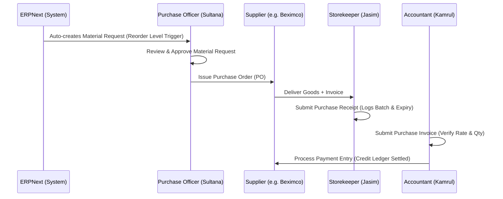
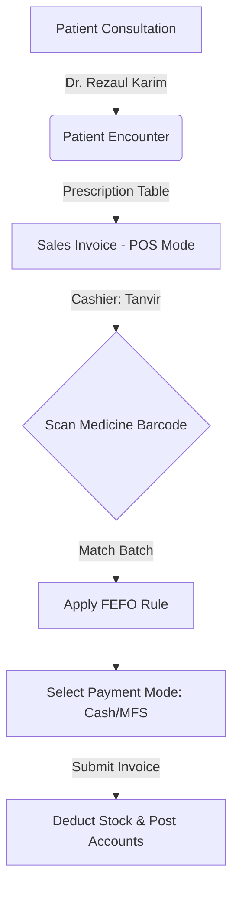

# Antigravity Pharmacy — Operational Workflows

To run the pharmacy business seamlessly, ERPNext is utilized to handle end-to-end tasks. This document details the 6 standard operational workflows of Antigravity Pharmacy, specifying the status transitions, active roles, and DocTypes used.

---

## 1. Procurement & Goods Receipt Workflow (P2P)
*This workflow runs whenever medicine stock levels fall below their reorder threshold or for bulk procurement.*

### 1.1 — Process Flow Diagram

### 1.2 — DocType Details & States

| Step | DocType | Created By | Approver | Key Fields / Checks | Status Transitions |
|---|---|---|---|---|---|
| 1 | `Material Request` | System (Auto) / Purchase Officer | Purchase Manager | `item_code`, `qty`, `warehouse` | Draft ➔ Pending ➔ Ordered |
| 2 | `Purchase Order` | Purchase Officer | Purchase Manager | `supplier`, `rate`, `payment_terms` | Draft ➔ To Receive and Bill ➔ Completed |
| 3 | `Purchase Receipt` | Storekeeper | Stock Manager | `batch_no`, `expiry_date`, `rejected_qty` | Draft ➔ To Bill ➔ Completed |
| 4 | `Purchase Invoice` | Accountant | Accounts Manager | `tax_template`, `expense_account` | Draft ➔ Unpaid ➔ Paid |
| 5 | `Payment Entry` | Accountant | Accounts Manager | `bank_account`, `allocated_amount` | Draft ➔ Submitted |

---

## 2. Cold Chain Management & Replenishment Flow
*Ensures vaccines and biological drugs (e.g., insulin) are stored within 2–8°C limits without breakages.*

### 2.1 — Step-by-Step Procedure
1. **Receipt at Main Dock:** Storekeeper (`Jasim`) receives `NOVORAPID-FP` at the main store.
2. **Cold Box Check:** Check temperature sensor inside the supplier's cooler box.
3. **Purchase Receipt:** Storekeeper submits `Purchase Receipt` under `Main Distribution Store - AG`.
4. **Immediate Transfer:** System creates an automatic alert to transfer cold items.
5. **Stock Entry (Transfer):** Storekeeper transfers the item from `Main Distribution Store - AG` to `Cold Storage - AG` using `Stock Entry` (Material Transfer).
6. **Shelf Replenishment:** When POS stock runs low, the cashier requests stock, and the storekeeper transfers a minor quantity (e.g. 5 pens) to the counter's desktop fridge.

### 2.2 — Key Verification Actions
- Batch temperature logs recorded in remarks.
- Verification that `Cold Storage` warehouse balance is updated.

---

## 3. Prescription to POS Checkout Flow (O2C)
*Handles prescription-to-sale integration.*

### 3.1 — Process Flow Diagram

### 3.2 — Execution Steps
1. **Prescription Generation:** Dr. Rezaul Karim fills out the `Patient Encounter` in ERPNext Healthcare. He adds `SECLO-20` (Dosage: 1-0-1, Duration: 15 Days).
2. **Billing Retrieval:** Patient goes to the pharmacy counter. POS Cashier `Tanvir` opens the POS interface and selects the Patient.
3. **Add Items:** Cashier clicks "Get Items from Prescription". The prescription details are auto-loaded.
4. **Barcode Verification:** Cashier scans the barcode on the strip. System matches the item and selects the batch.
5. **FEFO Selection:** System auto-proposes the batch with the nearest expiry date.
6. **Payment Processing:** Payment is received via Cash or Mobile Financial Services (MFS - bKash/Nagad). POS Invoice is submitted, printing the receipt.

---

## 4. Expired Stock Auditing & Disposal Flow
*How the pharmacy tracks, quarantines, and writes off expired medications.*

### 4.1 — Chronological Workflow

### 4.2 — DocType Details & States

#### Step 1: Stock Entry (Material Transfer)
* **Purpose:** Move expired items out of active selling zones into the quarantined area.
* **Source Warehouse:** `Retail POS Front - AG` or `Cold Storage - AG`
* **Target Warehouse:** `Quarantine / Expired - AG`
* **Status:** Submitted. (No financial write-off occurs yet; stock value is still in Assets).

#### Step 2: Stock Entry (Material Issue)
* **Purpose:** Scrap the quarantined items and write off their value.
* **Source Warehouse:** `Quarantine / Expired - AG`
* **Target Warehouse:** *(None)*
* **Account Debited:** `Drug Expiry Write-Off - AG` (Expense account on the Profit & Loss statement).
* **Approval Required:** Chief Pharmacist (`Dr. Nigar Sultana`) must approve.
* **Status:** Submitted (Stock is permanently removed, and asset value is reduced).

---

## 5. Walk-in OTC (Over-The-Counter) Sale Flow
*Used for general customers buying OTC drugs like Ace Plus or vitamins without a prescription.*

1. **Patient Registration (Optional):** If the customer is new, the cashier enters their name and phone number. If they decline, the default `Walk-In Customer` profile is used.
2. **Barcode Scan:** Cashier scans the OTC medication.
3. **Validation:** System checks batch inventory. If the stock of the oldest batch is zero, it moves to the next oldest batch.
4. **Discount (Optional):** If the customer is a regular, the cashier may apply a discretionary discount up to 5% (configured in the `POS Profile`).
5. **Payment & Print:** Cashier processes cash payment and prints the thermal slip.

---

## 6. Doctor Consultation Booking & Billing Flow
*For patients booking a consultation with the in-house doctor.*

1. **Appointment Creation:** Desk clerk registers the patient and creates a `Patient Appointment` for Dr. Rezaul Karim.
2. **Fee Generation:** System automatically prompts for the consultation fee (৳500) and registration fee (৳50, if new).
3. **Invoice Submission:** Sales Invoice (Services Mode) is created and paid by the patient.
4. **Clinical Encounter:** Doctor sees the patient in the queue, reviews the paid status, conducts the checkup, and writes the prescription.

---

## 7. Daily POS Cash Closure & Reconciliation Flow (Financials)
*Ensures the physical cash collected matches the system's recorded sales at the end of every shift.*

### 7.1 — Step-by-Step Procedure
1. **End of Shift:** POS Cashier (`Tanvir`) finishes their shift and counts the physical cash in the drawer.
2. **POS Closing Voucher:** Cashier navigates to ERPNext and creates a `POS Closing Voucher` for their active POS Profile.
3. **Enter Denominations:** The cashier inputs the physical cash count.
4. **System Matching:** The system calculates the Expected Cash based on the `POS Opening Voucher` + `Sales Invoices` generated during the shift.
5. **Accountant Verification:** Accountant (`Kamrul`) reviews the `POS Closing Voucher`. If there is a minor discrepancy (e.g. ৳5 shortage), the accountant allocates it to `Cash Shortage/Overage Account`.
6. **Submit & Settle:** The accountant submits the voucher, which automatically generates a consolidated `Sales Invoice` and `Payment Entry` mapping the cash to the `Cash In Hand - AG` ledger.

---

## 8. Stock Cycle Counting & Physical Reconciliation Flow
*Ensures that ERPNext's virtual stock levels perfectly align with physical shelves to prevent stock-outs.*

### 8.1 — Step-by-Step Procedure
1. **Initiate Audit:** Every weekend, the Store Keeper (`Jasim`) selects a category (e.g., "Antibiotics").
2. **Physical Count:** Jasim counts the physical boxes on the shelves.
3. **Draft Stock Reconciliation:** Jasim opens a new `Stock Reconciliation` document, selecting the `Retail POS Front - AG` warehouse.
4. **Input Data:** Using a barcode scanner, Jasim scans the items and inputs the physical count.
5. **System Variance Calculation:** The system calculates the difference between system stock and physical stock.
6. **Manager Approval:** Stock Auditor / Manager reviews the variance. If there's a missing strip, the variance is approved, and the value is debited to `Stock Adjustment / Loss - AG`.
7. **Submit:** Upon submission, the inventory levels are corrected, and the GL accounts are instantly updated.

---

## 9. Supplier Payments & AP Aging Flow
*Managing pharmacy cash flow and paying suppliers on time.*

### 9.1 — Step-by-Step Procedure
1. **Aging Review:** Accountant (`Kamrul`) opens the `Accounts Payable Aging` report to see which supplier invoices (e.g., Beximco Pharmaceuticals) are past 30 days due.
2. **Payment Entry:** Accountant creates a `Payment Entry`.
3. **Party Details:** Select Party Type `Supplier` and Party `Beximco`.
4. **Allocation:** The system pulls all outstanding `Purchase Invoices` for Beximco. Kamrul allocates the payment amount (৳50,000) to the oldest invoices.
5. **Bank Deduction:** Mode of Payment is selected as `Bank Transfer`. Account Paid From is `Prime Bank - AG`.
6. **Submission:** Upon submission, the supplier's balance is reduced, and the bank ledger is credited.
