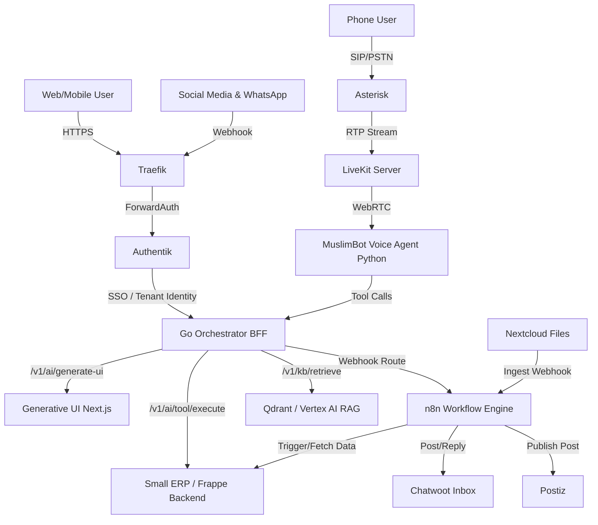

# Skill: manage_muslimbot_system

## Description
This skill provides the comprehensive context, operational guidelines, and architectural understanding necessary to manage, expand, or debug the MuslimBot ecosystem. Use this skill when asked to perform cross-system operations, orchestrate deployments, or debug unified flows spanning the Generative UI, Go Orchestrator, Frappe ERP, and Voice Agent.

## System Architecture Diagram

## Management & Development Guidelines
1. **Zero-Trust & SSO:** All incoming traffic must route through Traefik and be validated by Authentik. Never bypass the Go Orchestrator for direct API calls to `small_erp` from the frontend.
2. **Tenant Context Propagation:** Multi-tenancy is enforced by the Go Orchestrator reading headers (subdomain or `X-Tenant-Id`) and passing them downstream to the Frappe backend.
3. **Confirm Before Write:** Any system action that mutates state in `small_erp` (Master Controller tools like creating orders or approving leaves) must return a UI confirmation card to keep a human in the loop.
4. **Docs as Source of Truth:** Refer to `docs/ROOT.md` and the `docs/workflows/` folder for all architectural expansions and intended user flows.
5. **Headless ERP Only:** Do not modify or build upon the legacy ERPNext frontend (`/ops`). All user interactions should happen via the `generative-ui` or secure iframes (SecurePortal).
