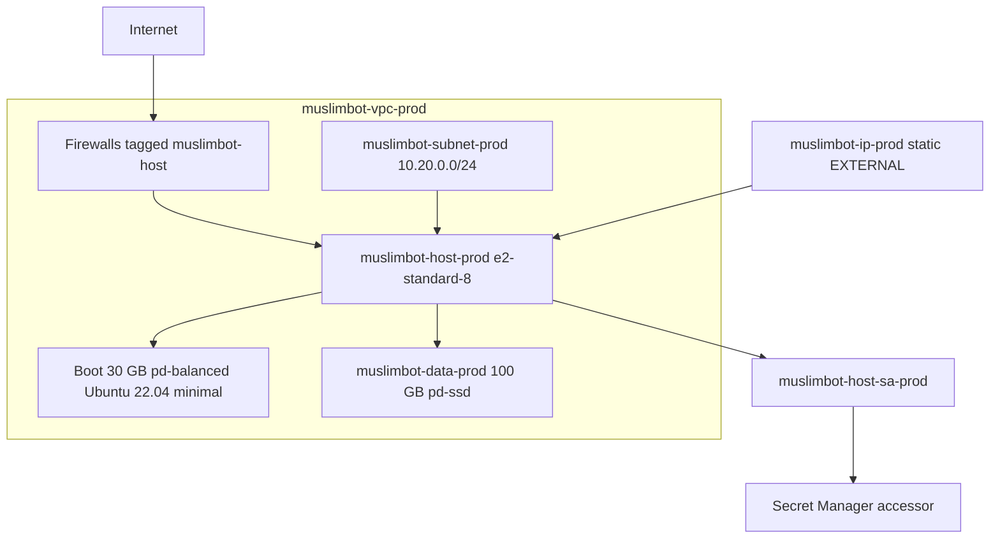

# MuslimBot Single-Host — As-Built Infrastructure Record

This document records the **as-deployed** GCP single-host environment that
was provisioned from this module on **2026-07-18** (UTC+6) and later fully
destroyed with `terraform destroy` the same day. Use it to **replicate** the
same topology, sizing, networking, and bootstrap behaviour.

Companion docs:

- [Module usage (provision / SSH / profiles)](README.md)
- [State management and destroy runbook](STATE_AND_DESTROY.md)
- [Parent Terraform index](../README.md)
- [Compose reference](../../../COMPOSE.md)
- [VM deployment plan (application layer)](../../docs/production/VM_DEPLOYMENT_PLAN.md)

---

## 1. Deployment identity (as-built)

| Field | Value |
|-------|-------|
| Terraform root | `MuslimBot/terraform/single-host/` |
| GCP project | `gen-lang-client-0113022969` |
| Region / zone | `asia-south1` / `asia-south1-a` (Mumbai) |
| Environment suffix | `prod` |
| Profile applied | **Full** (`e2-standard-8` + `pd-ssd`) |
| Provider | `hashicorp/google` `~> 5.0` (lock: v5.45.2) |
| Terraform | `>= 1.5` (applied with 1.15.x) |
| Backend | **Local** (`terraform.tfstate` on the operator machine; GCS backend commented) |
| Public IP (historical) | `8.231.65.7` — released on destroy |
| Destroyed | 2026-07-18 — `Apply complete! Resources: 0 added, 0 changed, 10 destroyed.` |

After destroy, Terraform state is empty and no `muslimbot-*` Compute/IAM
resources remain in the project. A local pre-destroy state copy may exist as
`terraform.tfstate.pre-destroy.*` (gitignored; local operator archive only).

---

## 2. Architecture (what was created)



### Resources (10)

| Terraform address | GCP name | Role |
|-------------------|----------|------|
| `google_compute_network.vpc` | `muslimbot-vpc-prod` | Custom VPC, no auto-subnets |
| `google_compute_subnetwork.public` | `muslimbot-subnet-prod` | `10.20.0.0/24` in `asia-south1` |
| `google_compute_address.host` | `muslimbot-ip-prod` | Regional static external IP |
| `google_compute_firewall.allow_ssh` | `muslimbot-allow-ssh-prod` | TCP 22 |
| `google_compute_firewall.allow_web` | `muslimbot-allow-web-prod` | TCP 80, 443 |
| `google_compute_firewall.allow_livekit` | `muslimbot-allow-livekit-prod` | TCP 7880/7881; UDP 50000–50100 |
| `google_compute_disk.data` | `muslimbot-data-prod` | 100 GB `pd-ssd`, zone `asia-south1-a` |
| `google_compute_instance.host` | `muslimbot-host-prod` | All-in-one Compose host |
| `google_service_account.host` | `muslimbot-host-sa-prod@…` | VM identity |
| `google_project_iam_member.host_secret_accessor` | — | `roles/secretmanager.secretAccessor` |

Network tag on the instance: `muslimbot-host` (firewall target).

---

## 3. Compute and storage specification

| Setting | As-built (Full) | Low profile (alternate) |
|---------|-----------------|-------------------------|
| Machine type | `e2-standard-8` (8 vCPU / 32 GB) | `e2-standard-4` (4 / 16 GB) |
| Boot disk | 30 GB `pd-balanced` | same |
| OS image | `ubuntu-os-cloud/ubuntu-minimal-2204-lts` | same |
| Data disk | 100 GB `pd-ssd` | 100 GB `pd-balanced` |
| Device name | `muslimbot-data` → `/dev/disk/by-id/google-muslimbot-data` | same |
| Mount point | `/opt/muslimbot/data` | same |
| OS Login | `enable-oslogin = TRUE` | same |
| Deletion protection | `false` | same |

**Sizing rationale (Full):** Compose steady-state ~14–15 GB RAM (Core ~4.5 +
Support ~3.3 + Voice ~2.1 + Platform ~1.6 + Social ~1.2). 32 GB leaves headroom
for page cache, image builds, and spikes so MariaDB/Redis avoid swap.

**Firewall rationale:** 22 = SSH; 80/443 = Traefik; 7880/7881 TCP + UDP
50000–50100 = LiveKit signaling and WebRTC media (aligned with
`configs/livekit/livekit.gcp.yaml`).

---

## 4. Guest bootstrap (startup script)

On first boot the instance:

1. Waits for `/dev/disk/by-id/google-muslimbot-data`.
2. Formats with `ext4` only if unformatted; labels `muslimbot-data`.
3. Mounts at `/opt/muslimbot/data` and persists via UUID in `/etc/fstab`.
4. Creates dirs: `mariadb`, `postgres`, `redis`, `chatwoot`, `trypost`, `n8n`, `frappe`.
5. Installs Docker CE + Compose plugin; enables `docker`.
6. Raises `net.core.rmem_max` / `wmem_max` for LiveKit media buffers.

Application Compose is **not** started by Terraform. Deploy the app after SSH
(see [VM_DEPLOYMENT_PLAN.md](../../docs/production/VM_DEPLOYMENT_PLAN.md) and
[README.md](README.md)).

---

## 5. Labels

Applied to billable resources:

```text
app=muslimbot
managed-by=terraform
topology=single-host
environment=prod
```

---

## 6. APIs required (one-time per project)

Enable before the first apply:

```bash
gcloud services enable \
  compute.googleapis.com \
  iam.googleapis.com \
  secretmanager.googleapis.com \
  cloudresourcemanager.googleapis.com
```

The first apply failed until `compute.googleapis.com` was enabled; IAM SA
creation succeeded before Compute. Always enable APIs, wait for propagation,
then `terraform plan` / `apply`.

Align ADC quota project with the active project:

```bash
gcloud auth application-default set-quota-project gen-lang-client-0113022969
```

---

## 7. How to replicate (exact recreation)

From a clean machine with Terraform ≥ 1.5 and authenticated gcloud ADC:

```bash
# 1. Auth + project + APIs
gcloud auth login
gcloud auth application-default login
gcloud auth application-default set-quota-project gen-lang-client-0113022969
gcloud config set project gen-lang-client-0113022969
gcloud services enable \
  compute.googleapis.com \
  iam.googleapis.com \
  secretmanager.googleapis.com \
  cloudresourcemanager.googleapis.com

# 2. Apply Full profile (defaults match as-built)
cd MuslimBot/terraform/single-host
terraform init
terraform validate
terraform plan -out=tfplan
terraform apply tfplan

# 3. Connect
gcloud compute ssh "$(terraform output -raw instance_name)" \
  --zone="$(terraform output -raw zone)" \
  --project=gen-lang-client-0113022969

# 4. Confirm bootstrap
df -h /opt/muslimbot/data
docker --version
docker compose version
```

### Low / MVP variant

```bash
terraform plan -out=tfplan \
  -var='machine_type=e2-standard-4' \
  -var='data_disk_type=pd-balanced'
terraform apply tfplan
```

### Optional overrides

| Variable | As-built default | Notes |
|----------|------------------|-------|
| `project_id` | `gen-lang-client-0113022969` | Change for other GCP projects |
| `region` | `asia-south1` | Or `asia-south2` |
| `zone` | `asia-south1-a` | Must match region |
| `environment` | `prod` | Changes all resource name suffixes |
| `ssh_source_ranges` | `0.0.0.0/0` | Tighten for production |
| `web_source_ranges` | `0.0.0.0/0` | Tighten if possible |
| `deletion_protection` | `false` | Set `true` for lasting prod |

A new apply allocates a **new** static IP. Update DNS / Compose public URLs
accordingly.

---

## 8. Expected outputs after apply

```text
instance_public_ip     # new EXTERNAL address
vpc_id
data_disk_attached     # may false-negative on self-link format; verify with gcloud
instance_name          # muslimbot-host-<environment>
data_disk_name
data_disk_device_name
data_mount_point
zone
service_account_email
```

---

## 9. Cost control (post-replication)

| Action | Effect |
|--------|--------|
| `gcloud compute instances stop …` | Stops vCPU/RAM billing; **disks + static IP still bill** |
| `terraform destroy` | Removes all 10 resources; near-zero ongoing cost for this stack |
| Snapshot then destroy | Keeps cheap snapshot storage if you need data later |

Full destroy procedure: [STATE_AND_DESTROY.md](STATE_AND_DESTROY.md).

---

## 10. Out of scope (not provisioned by this module)

- Cloud DNS / ACME certificates
- Artifact Registry / Cloud Build
- Secret Manager **secret values**
- GCS backup buckets
- Docker Compose / MuslimBot application install

Those belong to later roadmap phases and the application deployment guides.

---

## 11. Source of truth in git

| Path | Purpose |
|------|---------|
| [`main.tf`](main.tf) | Provider, VPC, firewall, disk, instance, startup |
| [`variables.tf`](variables.tf) | Defaults and Full/Low validations |
| [`outputs.tf`](outputs.tf) | IP, VPC, disk, SA |
| [`.terraform.lock.hcl`](.terraform.lock.hcl) | Provider lock (commit) |
| `terraform.tfstate*` | Local state — **never commit** |
